# Basic R Data Structures

***

## Types

What are the scalar types in R?


```r
# Scalars are just vectors of length one
```


## Weirdness of R

What is the major difference between atomic vectors and lists? How can you turn a list into an atomic vector?

In order to check if an object is of a certain type you can use `is.[type](object)` ,e.g. `is.integer(object)`

Can you use the `is.vector()` function to understand whether a data structure is a vector? If
not, what are the functions that you can use for this purpose?


```r
# Atomic vectors can contain elements of the same type. The elements of a list 
# can have different types.

# Yes, we can use the `is.vector()` function to understand is the structure is a 
# vector. It will return TRUE or FALSE.

a <- list(c(1,2,3), "bla", TRUE)
print(a)
```

```
## [[1]]
## [1] 1 2 3
## 
## [[2]]
## [1] "bla"
## 
## [[3]]
## [1] TRUE
```

```r
is.vector(a)
```

```
## [1] TRUE
```

```r
# Best response: If possible you should use type specific coercions like 
# `as.numeric()` or `as.character()`. But since lists are heterogenous, this 
# might not work. A more general function is `unlist()`,  which returns the list 
# into a vector of the most general type. Notice this difference:

a <- list(c(1,2,3), "bla", TRUE)
unlist(a)
```

```
## [1] "1"    "2"    "3"    "bla"  "TRUE"
```

```r
as.character(a)
```

```
## [1] "c(1, 2, 3)" "bla"        "TRUE"
```

```r
# Generally you can, but here comes the weird part: `is.vector()` will only return `TRUE` if the vector has 
# no attributes `names`. Therefore more specific functions like `is.atomic()` or `is.list()` functions should 
# be used to test if an object is actually atomic vectoror a list
```


## Atomic Vector Concatenation

What happens when you try to generate an atomic vector with `c()`which is composed of different types of elements? What is the `mean()` 
of a logical vector?


```r
# When we attempt to combine different types they will be coerced to the most 
# flexible type. Types from least to most flexible are: logical, integer, double
#  and character.

str(c("a", 1)) # 1 corced to char
```

```
##  chr [1:2] "a" "1"
```

```r
# As TRUE is encoded as 1 and FALSE as 0, the mean is the number of TRUEs 
# devided by the vector length.
mean(c(TRUE, FALSE,FALSE))
```

```
## [1] 0.3333333
```


## Vector Concatenation

Compare X and Y where X and Y are defined as follows. What is the difference?


```r
x <- list(list(1,2), c(3,4))
y <- c(list(1,2), c(3,4))
```


```r
# Answer
# X will combine seveal lists into one. Given a combination of atomic vectors 
# and lists, y will coerce the vectors to lists before combining them.
str(x)
```

```
## List of 2
##  $ :List of 2
##   ..$ : num 1
##   ..$ : num 2
##  $ : num [1:2] 3 4
```

```r
str(y)
```

```
## List of 4
##  $ : num 1
##  $ : num 2
##  $ : num 3
##  $ : num 4
```

## From Vectors to `data.frames`

First, create three named numeric vectors of size 10, 11 and 12 respectively in the following
manner:

* One vector with the “colon” approach: *from:to*
* One vector with the `seq()` function: *seq(from, to)*
* And one vector with the `seq()` function and the by argument: *seq(from, to, by)*

For easier naming you can use the vector `letters` or `LETTERS` which contain the latin alphabet
in small and capital, respectively. In order to select specific letters just use e.g. `letters[1:4]`
to get the first four letters. 
Check their types. What is the outcome? Where do you think does the difference come from?

Then combine all three vectors in a list. Check the attributes of the vectors and the list.
What is the difference and why?

Finally coerce the list to a `data.frame` with `as.data.frame()`. Why does it fail and how can we fix it? 
What happend to the names?

Hint: If list elements have no names, we can access them with the double brackets and an
index, e.g. `my_list[[1]]`


```r
# Answer

# A. create vectors
aa <- 1:10
names(aa) <- letters[aa]
aa
```

```
##  a  b  c  d  e  f  g  h  i  j 
##  1  2  3  4  5  6  7  8  9 10
```

```r
bb <- seq(1, 11)
names(bb) <- letters[bb]
bb
```

```
##  a  b  c  d  e  f  g  h  i  j  k 
##  1  2  3  4  5  6  7  8  9 10 11
```

```r
cc <- seq(1, 12, by=1)
names(cc) <- letters[cc]

typeof(aa)
```

```
## [1] "integer"
```

```r
typeof(bb)
```

```
## [1] "integer"
```

```r
typeof(cc)
```

```
## [1] "double"
```

```r
# B. Combine all three vectors in a list
 
my_list <- list(aa, bb, cc)
my_list
```

```
## [[1]]
##  a  b  c  d  e  f  g  h  i  j 
##  1  2  3  4  5  6  7  8  9 10 
## 
## [[2]]
##  a  b  c  d  e  f  g  h  i  j  k 
##  1  2  3  4  5  6  7  8  9 10 11 
## 
## [[3]]
##  a  b  c  d  e  f  g  h  i  j  k  l 
##  1  2  3  4  5  6  7  8  9 10 11 12
```

```r
attributes(aa)
```

```
## $names
##  [1] "a" "b" "c" "d" "e" "f" "g" "h" "i" "j"
```

```r
attributes(bb)
```

```
## $names
##  [1] "a" "b" "c" "d" "e" "f" "g" "h" "i" "j" "k"
```

```r
attributes(cc)
```

```
## $names
##  [1] "a" "b" "c" "d" "e" "f" "g" "h" "i" "j" "k" "l"
```

```r
attributes(my_list)
```

```
## NULL
```

```r
# C. Coerce to data.frames

# my_df <- as.data.frame(my_list)# fails

# Fixing the length
my_list[[1]] <- c(my_list[[1]], NA, NA)
my_list[[2]] <- c(my_list[[2]], NA)

my_df <- as.data.frame(my_list)
names(my_df) <- LETTERS[1:3]
my_df
```

<div data-pagedtable="false">
  <script data-pagedtable-source type="application/json">
{"columns":[{"label":[""],"name":["_rn_"],"type":[""],"align":["left"]},{"label":["A"],"name":[1],"type":["int"],"align":["right"]},{"label":["B"],"name":[2],"type":["int"],"align":["right"]},{"label":["C"],"name":[3],"type":["dbl"],"align":["right"]}],"data":[{"1":"1","2":"1","3":"1","_rn_":"a"},{"1":"2","2":"2","3":"2","_rn_":"b"},{"1":"3","2":"3","3":"3","_rn_":"c"},{"1":"4","2":"4","3":"4","_rn_":"d"},{"1":"5","2":"5","3":"5","_rn_":"e"},{"1":"6","2":"6","3":"6","_rn_":"f"},{"1":"7","2":"7","3":"7","_rn_":"g"},{"1":"8","2":"8","3":"8","_rn_":"h"},{"1":"9","2":"9","3":"9","_rn_":"i"},{"1":"10","2":"10","3":"10","_rn_":"j"},{"1":"NA","2":"11","3":"11","_rn_":"k"},{"1":"NA","2":"NA","3":"12","_rn_":""}],"options":{"columns":{"min":{},"max":[10]},"rows":{"min":[10],"max":[10]},"pages":{}}}
  </script>
</div>

## Attributes
Take again our `data.frame` from Question 5.

* Change the row names and the column names of the `data.frame` to capital letters (or small letters, if they 
are already capital.
* Change the `class` attribute to *list*. What happens?
* Change it now to any name you like. What happens now? What happens if you remove the class attribute


```r
# Answer
# A. One possible way through attributes

attributes(my_df)
```

```
## $names
## [1] "A" "B" "C"
## 
## $row.names
##  [1] "a" "b" "c" "d" "e" "f" "g" "h" "i" "j" "k" "" 
## 
## $class
## [1] "data.frame"
```

```r
attr(my_df, "names") <- letters[1:3]
attr(my_df, "row.names") <- LETTERS[1:12]
my_df
```

<div data-pagedtable="false">
  <script data-pagedtable-source type="application/json">
{"columns":[{"label":[""],"name":["_rn_"],"type":[""],"align":["left"]},{"label":["a"],"name":[1],"type":["int"],"align":["right"]},{"label":["b"],"name":[2],"type":["int"],"align":["right"]},{"label":["c"],"name":[3],"type":["dbl"],"align":["right"]}],"data":[{"1":"1","2":"1","3":"1","_rn_":"A"},{"1":"2","2":"2","3":"2","_rn_":"B"},{"1":"3","2":"3","3":"3","_rn_":"C"},{"1":"4","2":"4","3":"4","_rn_":"D"},{"1":"5","2":"5","3":"5","_rn_":"E"},{"1":"6","2":"6","3":"6","_rn_":"F"},{"1":"7","2":"7","3":"7","_rn_":"G"},{"1":"8","2":"8","3":"8","_rn_":"H"},{"1":"9","2":"9","3":"9","_rn_":"I"},{"1":"10","2":"10","3":"10","_rn_":"J"},{"1":"NA","2":"11","3":"11","_rn_":"K"},{"1":"NA","2":"NA","3":"12","_rn_":"L"}],"options":{"columns":{"min":{},"max":[10]},"rows":{"min":[10],"max":[10]},"pages":{}}}
  </script>
</div>

```r
# Or through accessor functions

names(my_df) <- LETTERS[1:3]
row.names(my_df) <- letters[1:12]
my_df
```

<div data-pagedtable="false">
  <script data-pagedtable-source type="application/json">
{"columns":[{"label":[""],"name":["_rn_"],"type":[""],"align":["left"]},{"label":["A"],"name":[1],"type":["int"],"align":["right"]},{"label":["B"],"name":[2],"type":["int"],"align":["right"]},{"label":["C"],"name":[3],"type":["dbl"],"align":["right"]}],"data":[{"1":"1","2":"1","3":"1","_rn_":"a"},{"1":"2","2":"2","3":"2","_rn_":"b"},{"1":"3","2":"3","3":"3","_rn_":"c"},{"1":"4","2":"4","3":"4","_rn_":"d"},{"1":"5","2":"5","3":"5","_rn_":"e"},{"1":"6","2":"6","3":"6","_rn_":"f"},{"1":"7","2":"7","3":"7","_rn_":"g"},{"1":"8","2":"8","3":"8","_rn_":"h"},{"1":"9","2":"9","3":"9","_rn_":"i"},{"1":"10","2":"10","3":"10","_rn_":"j"},{"1":"NA","2":"11","3":"11","_rn_":"k"},{"1":"NA","2":"NA","3":"12","_rn_":"l"}],"options":{"columns":{"min":{},"max":[10]},"rows":{"min":[10],"max":[10]},"pages":{}}}
  </script>
</div>

```r
# B. 

attr(my_df, "class") <- "list"
my_df
```

```
## $A
##  [1]  1  2  3  4  5  6  7  8  9 10 NA NA
## 
## $B
##  [1]  1  2  3  4  5  6  7  8  9 10 11 NA
## 
## $C
##  [1]  1  2  3  4  5  6  7  8  9 10 11 12
## 
## attr(,"row.names")
##  [1] "a" "b" "c" "d" "e" "f" "g" "h" "i" "j" "k" "l"
## attr(,"class")
## [1] "list"
```

```r
# Answer - the data.frame coerced to a list

# C
attr(my_df, "class") <- "Batman"
my_df
```

```
## $A
##  [1]  1  2  3  4  5  6  7  8  9 10 NA NA
## 
## $B
##  [1]  1  2  3  4  5  6  7  8  9 10 11 NA
## 
## $C
##  [1]  1  2  3  4  5  6  7  8  9 10 11 12
## 
## attr(,"row.names")
##  [1] "a" "b" "c" "d" "e" "f" "g" "h" "i" "j" "k" "l"
## attr(,"class")
## [1] "Batman"
```

```r
# Answer - Nothing changes
```

## Factors

* What is the difference between a Factor and a Vector?
* Create a vector of length 30 with three levels *Rita Repulsa, Lord Zedd* and *Rito Revolto* and equal length for each level
* What happens if you replace the second element of the vector with *Shredder*


```r
# Answer
# A. A factor is a vector that can contain only predefined values, and is used 
# to store categorical data. It is stored as an integer with a character string 
# associated with each integer value

# B.

x <- gl(n=3, k=10, length=30, labels=c("Rita Repulsa", "Lord Zedd", "Rito Revolto"))
str(x)
```

```
##  Factor w/ 3 levels "Rita Repulsa",..: 1 1 1 1 1 1 1 1 1 1 ...
```

```r
levels(x)
```

```
## [1] "Rita Repulsa" "Lord Zedd"    "Rito Revolto"
```

```r
attributes(x)
```

```
## $levels
## [1] "Rita Repulsa" "Lord Zedd"    "Rito Revolto"
## 
## $class
## [1] "factor"
```

```r
# C
x[2] <- "Shredder"
```

```
## Warning in `[<-.factor`(`*tmp*`, 2, value = "Shredder"): invalid factor
## level, NA generated
```

```r
# It doesn't work. We get the error 'NA generated'
```

## More fun with factors


```r
f1 <- factor(letters)
levels(f1) <- rev(levels(f1))
f2 <- rev(factor(letters))
f3 <- factor(letters, levels = rev(letters))
```

The function `rev` reverses the order of an orderable object. What is the difference between f1, f2 and f3? Why?


```r
# Answer
f1 <- factor(letters)
levels(f1) <- rev(levels(f1))

# f1 goes from a to z and when we apply the levels(f1), z will become 1 and a=26

f2 <- rev(factor(letters))

# f2 goes from z to a. but the levels are not changed.

f3 <- factor(letters, levels = rev(letters))

# f3 goes from a - z, but the underlying encoding goes from z = 1 to a = 26.  
# We create the vector with the letters a to z BUT the mapped integer structure 
# 26 to 1. Hence the levels but not the vector are reversed

f3
```

```
##  [1] a b c d e f g h i j k l m n o p q r s t u v w x y z
## Levels: z y x w v u t s r q p o n m l k j i h g f e d c b a
```

```r
# Reversing f3 will give f1

rev(f3)
```

```
##  [1] z y x w v u t s r q p o n m l k j i h g f e d c b a
## Levels: z y x w v u t s r q p o n m l k j i h g f e d c b a
```

## Creating data.frames

Create a data.frame with 26 rows like this: Only the first and the last six rows are shown.
Hint: Instead of the workaround with list you can also use simply `data.frame(column_name
= column_vector, ...)`


```r
aa <- seq(1:26)
bb <- seq(from=4, to=4*26, by=4)
cc <- rep(seq(1, 26, 2), each=2)
df <- data.frame(V1 = aa, V2 = bb, V3 = letters[cc])
head(df)
```

<div data-pagedtable="false">
  <script data-pagedtable-source type="application/json">
{"columns":[{"label":[""],"name":["_rn_"],"type":[""],"align":["left"]},{"label":["V1"],"name":[1],"type":["int"],"align":["right"]},{"label":["V2"],"name":[2],"type":["dbl"],"align":["right"]},{"label":["V3"],"name":[3],"type":["fctr"],"align":["left"]}],"data":[{"1":"1","2":"4","3":"a","_rn_":"1"},{"1":"2","2":"8","3":"a","_rn_":"2"},{"1":"3","2":"12","3":"c","_rn_":"3"},{"1":"4","2":"16","3":"c","_rn_":"4"},{"1":"5","2":"20","3":"e","_rn_":"5"},{"1":"6","2":"24","3":"e","_rn_":"6"}],"options":{"columns":{"min":{},"max":[10]},"rows":{"min":[10],"max":[10]},"pages":{}}}
  </script>
</div>

```r
tail(df)
```

<div data-pagedtable="false">
  <script data-pagedtable-source type="application/json">
{"columns":[{"label":[""],"name":["_rn_"],"type":[""],"align":["left"]},{"label":["V1"],"name":[1],"type":["int"],"align":["right"]},{"label":["V2"],"name":[2],"type":["dbl"],"align":["right"]},{"label":["V3"],"name":[3],"type":["fctr"],"align":["left"]}],"data":[{"1":"21","2":"84","3":"u","_rn_":"21"},{"1":"22","2":"88","3":"u","_rn_":"22"},{"1":"23","2":"92","3":"w","_rn_":"23"},{"1":"24","2":"96","3":"w","_rn_":"24"},{"1":"25","2":"100","3":"y","_rn_":"25"},{"1":"26","2":"104","3":"y","_rn_":"26"}],"options":{"columns":{"min":{},"max":[10]},"rows":{"min":[10],"max":[10]},"pages":{}}}
  </script>
</div>

## Combining `data.frames`

Now take the previous data.frame from Question 10 and reproduce the following `data.frame`.
Only the first and the last six rows are shown
**Hint:** In order to combine to data.frames by column you can use `cbind(df1, df2, ...)`

help(cbind)

```r
df[,1] <- NULL
dd <- rev(rep(seq(1, 26, 2), each = 2))
ee <- seq(0, 1.6, length.out = 26)
df2 <- data.frame(V4 = dd, V5 = ee)
binded_df <- cbind(df2, df)
head(binded_df)
```

<div data-pagedtable="false">
  <script data-pagedtable-source type="application/json">
{"columns":[{"label":[""],"name":["_rn_"],"type":[""],"align":["left"]},{"label":["V4"],"name":[1],"type":["dbl"],"align":["right"]},{"label":["V5"],"name":[2],"type":["dbl"],"align":["right"]},{"label":["V2"],"name":[3],"type":["dbl"],"align":["right"]},{"label":["V3"],"name":[4],"type":["fctr"],"align":["left"]}],"data":[{"1":"25","2":"0.000","3":"4","4":"a","_rn_":"1"},{"1":"25","2":"0.064","3":"8","4":"a","_rn_":"2"},{"1":"23","2":"0.128","3":"12","4":"c","_rn_":"3"},{"1":"23","2":"0.192","3":"16","4":"c","_rn_":"4"},{"1":"21","2":"0.256","3":"20","4":"e","_rn_":"5"},{"1":"21","2":"0.320","3":"24","4":"e","_rn_":"6"}],"options":{"columns":{"min":{},"max":[10]},"rows":{"min":[10],"max":[10]},"pages":{}}}
  </script>
</div>

```r
tail(binded_df)
```

<div data-pagedtable="false">
  <script data-pagedtable-source type="application/json">
{"columns":[{"label":[""],"name":["_rn_"],"type":[""],"align":["left"]},{"label":["V4"],"name":[1],"type":["dbl"],"align":["right"]},{"label":["V5"],"name":[2],"type":["dbl"],"align":["right"]},{"label":["V2"],"name":[3],"type":["dbl"],"align":["right"]},{"label":["V3"],"name":[4],"type":["fctr"],"align":["left"]}],"data":[{"1":"5","2":"1.280","3":"84","4":"u","_rn_":"21"},{"1":"5","2":"1.344","3":"88","4":"u","_rn_":"22"},{"1":"3","2":"1.408","3":"92","4":"w","_rn_":"23"},{"1":"3","2":"1.472","3":"96","4":"w","_rn_":"24"},{"1":"1","2":"1.536","3":"100","4":"y","_rn_":"25"},{"1":"1","2":"1.600","3":"104","4":"y","_rn_":"26"}],"options":{"columns":{"min":{},"max":[10]},"rows":{"min":[10],"max":[10]},"pages":{}}}
  </script>
</div>

## Computation on data.frames

Create the data.frame *df* with `df <- as.data.frame(matrix(runif(9e6), 3e3, 3e3))`
This will create a data.frame with 3000 columns and rows and a total of 9mil values.

Now compute the sum of any row, then compute the sum of any column. Measure the time
for both operations. Why are the times different, although the size is the same?

* **Hint1:** The time is measured with the function `system.time(my_function_call())`, e.g: `system.time(mean(my_vector))`
* **Hint2:** The sum can be computed with the sum function `sum(my_vector)`
* **Hint2:** Columns and rows are selected by single brackets. Rows: `df[row_number,]`, Columns: `df[,col_number]`


```r
# Answer

df <- as.data.frame(matrix(runif(9e6), 3e3, 3e3))

# rows
system.time(res <- sum(df[1,]))
```

```
##    user  system elapsed 
##   0.026   0.000   0.026
```

```r
res
```

```
## [1] 1498.521
```

```r
# columngs
system.time(res2 <- sum(df[,1]))
```

```
##    user  system elapsed 
##       0       0       0
```

```r
res2
```

```
## [1] 1506.478
```

```r
# Look at the structure of the objects over which we are computing the sum
# Column
str(df[1,])
```

```
## 'data.frame':	1 obs. of  3000 variables:
##  $ V1   : num 0.00262
##  $ V2   : num 0.957
##  $ V3   : num 0.175
##  $ V4   : num 0.991
##  $ V5   : num 0.222
##  $ V6   : num 0.382
##  $ V7   : num 0.699
##  $ V8   : num 0.904
##  $ V9   : num 0.193
##  $ V10  : num 0.284
##  $ V11  : num 0.238
##  $ V12  : num 0.717
##  $ V13  : num 0.979
##  $ V14  : num 0.285
##  $ V15  : num 0.656
##  $ V16  : num 0.119
##  $ V17  : num 0.646
##  $ V18  : num 0.991
##  $ V19  : num 0.0121
##  $ V20  : num 0.999
##  $ V21  : num 0.259
##  $ V22  : num 0.711
##  $ V23  : num 0.955
##  $ V24  : num 0.446
##  $ V25  : num 0.768
##  $ V26  : num 0.789
##  $ V27  : num 0.591
##  $ V28  : num 0.396
##  $ V29  : num 0.3
##  $ V30  : num 0.793
##  $ V31  : num 0.834
##  $ V32  : num 0.488
##  $ V33  : num 0.0548
##  $ V34  : num 0.596
##  $ V35  : num 0.905
##  $ V36  : num 0.173
##  $ V37  : num 0.078
##  $ V38  : num 0.998
##  $ V39  : num 0.272
##  $ V40  : num 0.268
##  $ V41  : num 0.207
##  $ V42  : num 0.253
##  $ V43  : num 0.764
##  $ V44  : num 0.229
##  $ V45  : num 0.622
##  $ V46  : num 0.485
##  $ V47  : num 0.617
##  $ V48  : num 0.946
##  $ V49  : num 0.664
##  $ V50  : num 0.173
##  $ V51  : num 0.917
##  $ V52  : num 0.87
##  $ V53  : num 0.463
##  $ V54  : num 0.274
##  $ V55  : num 0.551
##  $ V56  : num 0.971
##  $ V57  : num 0.32
##  $ V58  : num 0.44
##  $ V59  : num 0.875
##  $ V60  : num 0.655
##  $ V61  : num 0.793
##  $ V62  : num 0.291
##  $ V63  : num 0.984
##  $ V64  : num 0.502
##  $ V65  : num 0.105
##  $ V66  : num 0.424
##  $ V67  : num 0.115
##  $ V68  : num 0.773
##  $ V69  : num 0.164
##  $ V70  : num 0.484
##  $ V71  : num 0.143
##  $ V72  : num 0.583
##  $ V73  : num 0.349
##  $ V74  : num 0.19
##  $ V75  : num 0.425
##  $ V76  : num 0.66
##  $ V77  : num 0.646
##  $ V78  : num 0.87
##  $ V79  : num 0.65
##  $ V80  : num 0.202
##  $ V81  : num 0.607
##  $ V82  : num 0.833
##  $ V83  : num 0.713
##  $ V84  : num 0.425
##  $ V85  : num 0.608
##  $ V86  : num 0.103
##  $ V87  : num 0.76
##  $ V88  : num 0.581
##  $ V89  : num 0.142
##  $ V90  : num 0.697
##  $ V91  : num 0.841
##  $ V92  : num 0.246
##  $ V93  : num 0.416
##  $ V94  : num 0.0122
##  $ V95  : num 0.682
##  $ V96  : num 0.00994
##  $ V97  : num 0.417
##  $ V98  : num 0.501
##  $ V99  : num 0.764
##   [list output truncated]
```

```r
# Row
str(df[,1])
```

```
##  num [1:3000] 0.00262 0.69918 0.94426 0.55608 0.98968 ...
```

```r
# As we can see the extracted column is a numeric vector. But the extracted
# row is a list. Under the hood the sum function is iterating in C/Fortran
# over the specific structure. Iterating over a native array of doubles is
# faster, than iterating over a structure, where at each position, the value
# has to be retrieved from an object possibly strored somewhere further away
# in memory.
```

## Missing Values

* If NA is just a placeholder for a missing value of the same type and Infinity is of type
double, why is Infinity plus NA not Infinity?

**Hint:**

```r
paste(paste(rep((Inf - Inf), 20), collapse = ""), "Batman!")
```

```
## [1] "NaNNaNNaNNaNNaNNaNNaNNaNNaNNaNNaNNaNNaNNaNNaNNaNNaNNaNNaNNaN Batman!"
```


```r
# Answer:
# Because infinity is not a well defined number, but a concept with
# the type 'double' in R. Adding or subtracting any number from infinity
# will give infinity. However NA is placeholder for any value of the same
# type and therefore also for infinity. As infinity plus/minus infinity
# is not defined, adding NA to infinity can theoretically lead to
# Nan (not a number). Therefore Inf + NA will produce NA.

Inf + NA
```

```
## [1] NA
```

```r
Inf + 1
```

```
## [1] Inf
```

```r
Inf - Inf
```

```
## [1] NaN
```

---

# Advanced R Data Structures and Mathematical Operations

## Basic data structures

How would you create a 3 by 4 matrix that contains the numbers 1 to 12 and then convert it into a data frame?


```r
# Answer

x <- matrix(1:12, 3,4)
x <- as.data.frame(x)
x
```

<div data-pagedtable="false">
  <script data-pagedtable-source type="application/json">
{"columns":[{"label":["V1"],"name":[1],"type":["int"],"align":["right"]},{"label":["V2"],"name":[2],"type":["int"],"align":["right"]},{"label":["V3"],"name":[3],"type":["int"],"align":["right"]},{"label":["V4"],"name":[4],"type":["int"],"align":["right"]}],"data":[{"1":"1","2":"4","3":"7","4":"10"},{"1":"2","2":"5","3":"8","4":"11"},{"1":"3","2":"6","3":"9","4":"12"}],"options":{"columns":{"min":{},"max":[10]},"rows":{"min":[10],"max":[10]},"pages":{}}}
  </script>
</div>

## 
Please use the data frame you created in the first question for the next 5 questions. 
How would you select the second row elements at second and fourth column ?


```r
x <- data.frame(matrix(1:12, 3, 4))
x[2, c(2,4)]
```

<div data-pagedtable="false">
  <script data-pagedtable-source type="application/json">
{"columns":[{"label":[""],"name":["_rn_"],"type":[""],"align":["left"]},{"label":["X2"],"name":[1],"type":["int"],"align":["right"]},{"label":["X4"],"name":[2],"type":["int"],"align":["right"]}],"data":[{"1":"5","2":"11","_rn_":"2"}],"options":{"columns":{"min":{},"max":[10]},"rows":{"min":[10],"max":[10]},"pages":{}}}
  </script>
</div>

##
How would you assign zero to the elements at row 2 which are greater than 4?


```r
x <- data.frame(matrix(1:12, 3, 4))
x[2, x[2,]>4] <- 0
x
```

<div data-pagedtable="false">
  <script data-pagedtable-source type="application/json">
{"columns":[{"label":["X1"],"name":[1],"type":["int"],"align":["right"]},{"label":["X2"],"name":[2],"type":["dbl"],"align":["right"]},{"label":["X3"],"name":[3],"type":["dbl"],"align":["right"]},{"label":["X4"],"name":[4],"type":["dbl"],"align":["right"]}],"data":[{"1":"1","2":"4","3":"7","4":"10"},{"1":"2","2":"0","3":"0","4":"0"},{"1":"3","2":"6","3":"9","4":"12"}],"options":{"columns":{"min":{},"max":[10]},"rows":{"min":[10],"max":[10]},"pages":{}}}
  </script>
</div>

##
How do you set the rownames to “row1”, “row2”, “row3” and column names to “col1”, “col2”, “col3” and “col4” ?
(hint:use function “paste0”)


```r
x <- data.frame(matrix(1:12, 3, 4))
rownames(x) <- paste0("row", 1:3)
colnames(x) <- paste0("col", 1:4)
x
```

<div data-pagedtable="false">
  <script data-pagedtable-source type="application/json">
{"columns":[{"label":[""],"name":["_rn_"],"type":[""],"align":["left"]},{"label":["col1"],"name":[1],"type":["int"],"align":["right"]},{"label":["col2"],"name":[2],"type":["int"],"align":["right"]},{"label":["col3"],"name":[3],"type":["int"],"align":["right"]},{"label":["col4"],"name":[4],"type":["int"],"align":["right"]}],"data":[{"1":"1","2":"4","3":"7","4":"10","_rn_":"row1"},{"1":"2","2":"5","3":"8","4":"11","_rn_":"row2"},{"1":"3","2":"6","3":"9","4":"12","_rn_":"row3"}],"options":{"columns":{"min":{},"max":[10]},"rows":{"min":[10],"max":[10]},"pages":{}}}
  </script>
</div>

##
How do you assign 0 to all elements in columns “col3” and “col4” by using paste0 function ?


```r
x <- data.frame(matrix(1:12, 3, 4))
colnames(x) <- paste0("col", 1:4)
x[, paste0(0, 3:4)] <- 0
x
```

<div data-pagedtable="false">
  <script data-pagedtable-source type="application/json">
{"columns":[{"label":["col1"],"name":[1],"type":["int"],"align":["right"]},{"label":["col2"],"name":[2],"type":["int"],"align":["right"]},{"label":["col3"],"name":[3],"type":["int"],"align":["right"]},{"label":["col4"],"name":[4],"type":["int"],"align":["right"]},{"label":["03"],"name":[5],"type":["dbl"],"align":["right"]},{"label":["04"],"name":[6],"type":["dbl"],"align":["right"]}],"data":[{"1":"1","2":"4","3":"7","4":"10","5":"0","6":"0"},{"1":"2","2":"5","3":"8","4":"11","5":"0","6":"0"},{"1":"3","2":"6","3":"9","4":"12","5":"0","6":"0"}],"options":{"columns":{"min":{},"max":[10]},"rows":{"min":[10],"max":[10]},"pages":{}}}
  </script>
</div>

## `lapply()`
How do you get the numbers whose mod 2 is 0

* by using lapply() function 
* by subsetting the data frame directly?


```r
x <- data.frame(matrix(1:12), 3, 4)

lapply(x, function(a) a[(a %% 2) == 0])
```

```
## $matrix.1.12.
## [1]  2  4  6  8 10 12
## 
## $X3
## numeric(0)
## 
## $X4
##  [1] 4 4 4 4 4 4 4 4 4 4 4 4
```

```r
x[x %% 2 == 0]
```

```
##  [1]  2  4  6  8 10 12  4  4  4  4  4  4  4  4  4  4  4  4
```

##
Considering `x <- c(“a”=1, “b”=2, “c”=3, “d”=4, “e”=5)`, show how to select the third and fifth elements of x by using
positive integers, negative integers, a logical vector, and a character vector.


```r
x <- c("a"=1, "b"=2, "c"=3, "d"=4, "e"=5)
x[c(3,5)]
```

```
## c e 
## 3 5
```

```r
x[-c(1,2,4)]
```

```
## c e 
## 3 5
```

```r
x[c(F,F,T,F,T)]
```

```
## c e 
## 3 5
```

```r
x[c("c", "e")]
```

```
## c e 
## 3 5
```

##
Why are `vals[c(2, 5)]` and `vals[2, 5]` different where `vals <- outer(1:5, 1:5, FUN = “/”)`? How would you select fifth and
nineth elements of vals by the use of a matrix?


```r
vals <- outer(1:5, 1:5, FUN = "/")

# Because when you subset matrix with a vector, the 2d matrix behaves
# like a vector and vals[c(2, 5)] returns the elements at indices 2
# and 5 in column-major order. vals[2, 5] returns the element at row 2, column 5.

select <- matrix(ncol=2, byrow=TRUE, c(5,1,4,2))

vals[select]
```

```
## [1] 5 2
```


##
Consider df <- data.frame(a=paste(“Point_”, 1:20), b=rep(1:4, each = 2, len = 20), c= seq(1,40,length.out = 20),
stringsAsFactors = F). Assign “Point_undefined” to column a of all rows of df where column b > 1 and column c > 21 ?
What is the reason of the different result that you get if you do the same operation with df being created with option
stringsAsFactors = T ?

##
Assume x <- matrix(1:20, ncol=2). What is the difference between x[1, , drop = T] and x[1, , drop = F]? Now let y <-
as.data.frame(x). What is the difference between y[,1] , y[[1]] and y[1]

##
What is the difference between x[“b”] <- list(NULL) and x[“b”] <- NULL where x <- list(a = c(1:5), b = c(12:15))?

## 
Assume you have a lookup table as lookup <- c(a = “sun”, b = “rain”, c=“wind”, u = NA). How would you generate
the weekly weather predictions c(“sun”,“sun”,“rain”, NA, “rain”, “rain”, “wind”) out of this lookup table?

##
Now assume the weather in winter lookup table is a data frame as below and we have the predictions for the next week as
stored in weeklyCast. How would you create “weeklyTable” by the use of rownames function? How would you create it by
the use of match function? How would you order the rows of lookup table by desc column?

##
Consider the bigDF data frame which has 1500 columns and rows. How would you select the even numbered columns
named such as “Column_2”, “Column_4”, etc.? How would you select all the columns other than column 76? How
would you assign 1 to 500 randomly selected diagonal indices? How can you retrieve the row and column indices of the
elements which has been assigned 1? How would you select rows where columns Column_1 or Column_2 are 1 by using
the subset() function?

##
Assume x <- 1:20 %% 2 == 0 and y <- 1:20 %% 5 == 0 . What are the indices of the elements that are True for both
x and y? What are the indices of the elements that are True for either x or y, or both?

# Data Import

## Flat File - Q1

A csv file has numbers as column names in the first row, i.e. IDs to randomize persons. Which
parameter of read.table() needs to be adjusted to read the column names as they are in the
csv?


```r
tmp_tidy_table <- "1_colname, 2_colname, 3_colname
3,4,5
a,b,c"
tmp_tidy_table
```

```
## [1] "1_colname, 2_colname, 3_colname\n3,4,5\na,b,c"
```

```r
read.csv(text=tmp_tidy_table)
```

<div data-pagedtable="false">
  <script data-pagedtable-source type="application/json">
{"columns":[{"label":["X1_colname"],"name":[1],"type":["fctr"],"align":["left"]},{"label":["X2_colname"],"name":[2],"type":["fctr"],"align":["left"]},{"label":["X3_colname"],"name":[3],"type":["fctr"],"align":["left"]}],"data":[{"1":"3","2":"4","3":"5"},{"1":"a","2":"b","3":"c"}],"options":{"columns":{"min":{},"max":[10]},"rows":{"min":[10],"max":[10]},"pages":{}}}
  </script>
</div>

```r
# Parameter `check.names`: a logical, tests for synatactically valid varaible 
# names

tidy_text_df <- read.csv(text=tmp_tidy_table, check.names = FALSE)
tidy_text_df
```

<div data-pagedtable="false">
  <script data-pagedtable-source type="application/json">
{"columns":[{"label":["1_colname"],"name":[1],"type":["fctr"],"align":["left"]},{"label":["2_colname"],"name":[2],"type":["fctr"],"align":["left"]},{"label":["3_colname"],"name":[3],"type":["fctr"],"align":["left"]}],"data":[{"1":"3","2":"4","3":"5"},{"1":"a","2":"b","3":"c"}],"options":{"columns":{"min":{},"max":[10]},"rows":{"min":[10],"max":[10]},"pages":{}}}
  </script>
</div>


## Flat File - Q2

How to read the following table to have the `identical()` information as in `tidy_txt_df` from
question above?


```r
tmp_messy_table <- "# This line is just useless info

1_colname,2_colname,3_colname
3,4,5

a,b,c"
```


```r
# To have the identical information as in the previous table we have to check
# which lines are comments. We can do this with `comment.char` parameter.

messy_text_df <- read.csv(text = tmp_messy_table, comment.char = '#', check.names = F)
identical(messy_text_df, tidy_text_df)
```

```
## [1] TRUE
```

## Flat File - Q3

Read the `hollywood.tsv` (not *.csv) file into a `data.table` R object. What is the problem with
`fread()`?


```r
library(data.table)
file_holly_tab <- "extdata/hollywood.tsv"
holly <- as.data.table(read.delim(file_holly_tab), keep_row_names=T)
head(holly)
```

<div data-pagedtable="false">
  <script data-pagedtable-source type="application/json">
{"columns":[{"label":["Film"],"name":[1],"type":["fctr"],"align":["left"]},{"label":["Genre"],"name":[2],"type":["fctr"],"align":["left"]},{"label":["Lead.Studio"],"name":[3],"type":["fctr"],"align":["left"]},{"label":["Audience..score.."],"name":[4],"type":["int"],"align":["right"]},{"label":["Profitability"],"name":[5],"type":["dbl"],"align":["right"]},{"label":["Rotten.Tomatoes.."],"name":[6],"type":["int"],"align":["right"]},{"label":["Worldwide.Gross"],"name":[7],"type":["dbl"],"align":["right"]},{"label":["Year"],"name":[8],"type":["int"],"align":["right"]}],"data":[{"1":"27 Dresses","2":"Comedy","3":"Fox","4":"71","5":"5.3436218","6":"40","7":"160.308654","8":"2008"},{"1":"(500) Days of Summer","2":"Comedy","3":"Fox","4":"81","5":"8.0960000","6":"87","7":"60.720000","8":"2009"},{"1":"A Dangerous Method","2":"Drama","3":"Independent","4":"89","5":"0.4486447","6":"79","7":"8.972895","8":"2011"},{"1":"A Serious Man","2":"Drama","3":"Universal","4":"64","5":"4.3828571","6":"89","7":"30.680000","8":"2009"},{"1":"Across the Universe","2":"Romance","3":"Independent","4":"84","5":"0.6526032","6":"54","7":"29.367143","8":"2007"},{"1":"Beginners","2":"Comedy","3":"Independent","4":"80","5":"4.4718750","6":"84","7":"14.310000","8":"2011"}],"options":{"columns":{"min":{},"max":[10]},"rows":{"min":[10],"max":[10]},"pages":{}}}
  </script>
</div>

```r
class(holly)
```

```
## [1] "data.table" "data.frame"
```

```r
holly_data_table <- fread(file_holly_tab, skip=1)
class(holly_data_table)
```

```
## [1] "data.table" "data.frame"
```

```r
head(holly_data_table)
```

<div data-pagedtable="false">
  <script data-pagedtable-source type="application/json">
{"columns":[{"label":["V1"],"name":[1],"type":["chr"],"align":["left"]},{"label":["V2"],"name":[2],"type":["chr"],"align":["left"]},{"label":["V3"],"name":[3],"type":["chr"],"align":["left"]},{"label":["V4"],"name":[4],"type":["chr"],"align":["left"]},{"label":["V5"],"name":[5],"type":["int"],"align":["right"]},{"label":["V6"],"name":[6],"type":["dbl"],"align":["right"]},{"label":["V7"],"name":[7],"type":["int"],"align":["right"]},{"label":["V8"],"name":[8],"type":["dbl"],"align":["right"]},{"label":["V9"],"name":[9],"type":["int"],"align":["right"]}],"data":[{"1":"1","2":"27 Dresses","3":"Comedy","4":"Fox","5":"71","6":"5.3436218","7":"40","8":"160.308654","9":"2008"},{"1":"2","2":"(500) Days of Summer","3":"Comedy","4":"Fox","5":"81","6":"8.0960000","7":"87","8":"60.720000","9":"2009"},{"1":"3","2":"A Dangerous Method","3":"Drama","4":"Independent","5":"89","6":"0.4486447","7":"79","8":"8.972895","9":"2011"},{"1":"4","2":"A Serious Man","3":"Drama","4":"Universal","5":"64","6":"4.3828571","7":"89","8":"30.680000","9":"2009"},{"1":"5","2":"Across the Universe","3":"Romance","4":"Independent","5":"84","6":"0.6526032","7":"54","8":"29.367143","9":"2007"},{"1":"6","2":"Beginners","3":"Comedy","4":"Independent","5":"80","6":"4.4718750","7":"84","8":"14.310000","9":"2011"}],"options":{"columns":{"min":{},"max":[10]},"rows":{"min":[10],"max":[10]},"pages":{}}}
  </script>
</div>

```r
holly_cn <- c("ID", colnames(read.delim(file_holly_tab, nrows= 1)))
holly_cn
```

```
## [1] "ID"                "Film"              "Genre"            
## [4] "Lead.Studio"       "Audience..score.." "Profitability"    
## [7] "Rotten.Tomatoes.." "Worldwide.Gross"   "Year"
```

```r
# setnames(holly, holly_cn)
# head(holly)
# Difference between them: We can keep row_names. data.frame has no row_names.
```


## Flat File - Q4

Who was the oldest surviving passenger of the titanic accident (titanic.csv)? Tipp: `?subset`


```r
tit_df <- read.csv("extdata/titanic.csv")
head(tit_df)
```

<div data-pagedtable="false">
  <script data-pagedtable-source type="application/json">
{"columns":[{"label":[""],"name":["_rn_"],"type":[""],"align":["left"]},{"label":["pclass"],"name":[1],"type":["int"],"align":["right"]},{"label":["survived"],"name":[2],"type":["int"],"align":["right"]},{"label":["name"],"name":[3],"type":["fctr"],"align":["left"]},{"label":["sex"],"name":[4],"type":["fctr"],"align":["left"]},{"label":["age"],"name":[5],"type":["dbl"],"align":["right"]},{"label":["sibsp"],"name":[6],"type":["int"],"align":["right"]},{"label":["parch"],"name":[7],"type":["int"],"align":["right"]},{"label":["ticket"],"name":[8],"type":["fctr"],"align":["left"]},{"label":["fare"],"name":[9],"type":["dbl"],"align":["right"]},{"label":["cabin"],"name":[10],"type":["fctr"],"align":["left"]},{"label":["embarked"],"name":[11],"type":["fctr"],"align":["left"]},{"label":["boat"],"name":[12],"type":["fctr"],"align":["left"]},{"label":["body"],"name":[13],"type":["int"],"align":["right"]},{"label":["home.dest"],"name":[14],"type":["fctr"],"align":["left"]}],"data":[{"1":"1","2":"1","3":"Allen, Miss. Elisabeth Walton","4":"female","5":"29.00","6":"0","7":"0","8":"24160","9":"211.3375","10":"B5","11":"S","12":"2","13":"NA","14":"St Louis, MO","_rn_":"1"},{"1":"1","2":"1","3":"Allison, Master. Hudson Trevor","4":"male","5":"0.92","6":"1","7":"2","8":"113781","9":"151.5500","10":"C22 C26","11":"S","12":"11","13":"NA","14":"Montreal, PQ / Chesterville, ON","_rn_":"2"},{"1":"1","2":"0","3":"Allison, Miss. Helen Loraine","4":"female","5":"2.00","6":"1","7":"2","8":"113781","9":"151.5500","10":"C22 C26","11":"S","12":"","13":"NA","14":"Montreal, PQ / Chesterville, ON","_rn_":"3"},{"1":"1","2":"0","3":"Allison, Mr. Hudson Joshua Creighton","4":"male","5":"30.00","6":"1","7":"2","8":"113781","9":"151.5500","10":"C22 C26","11":"S","12":"","13":"135","14":"Montreal, PQ / Chesterville, ON","_rn_":"4"},{"1":"1","2":"0","3":"Allison, Mrs. Hudson J C (Bessie Waldo Daniels)","4":"female","5":"25.00","6":"1","7":"2","8":"113781","9":"151.5500","10":"C22 C26","11":"S","12":"","13":"NA","14":"Montreal, PQ / Chesterville, ON","_rn_":"5"},{"1":"1","2":"1","3":"Anderson, Mr. Harry","4":"male","5":"48.00","6":"0","7":"0","8":"19952","9":"26.5500","10":"E12","11":"S","12":"3","13":"NA","14":"New York, NY","_rn_":"6"}],"options":{"columns":{"min":{},"max":[10]},"rows":{"min":[10],"max":[10]},"pages":{}}}
  </script>
</div>

```r
survivor_name <- subset(tit_df, survived==1 & age==max(age, na.rm = T), name)
survivor_age <- subset(tit_df, survived==1 & age==max(age, na.rm = T), age)

survivor_name
```

<div data-pagedtable="false">
  <script data-pagedtable-source type="application/json">
{"columns":[{"label":[""],"name":["_rn_"],"type":[""],"align":["left"]},{"label":["name"],"name":[1],"type":["fctr"],"align":["left"]}],"data":[{"1":"Barkworth, Mr. Algernon Henry Wilson","_rn_":"15"}],"options":{"columns":{"min":{},"max":[10]},"rows":{"min":[10],"max":[10]},"pages":{}}}
  </script>
</div>

```r
survivor_age
```

<div data-pagedtable="false">
  <script data-pagedtable-source type="application/json">
{"columns":[{"label":[""],"name":["_rn_"],"type":[""],"align":["left"]},{"label":["age"],"name":[1],"type":["dbl"],"align":["right"]}],"data":[{"1":"80","_rn_":"15"}],"options":{"columns":{"min":{},"max":[10]},"rows":{"min":[10],"max":[10]},"pages":{}}}
  </script>
</div>


## Excel Questions - Q1

Read only Name, Type and Total columns for only the first 10 pokemons of the pokemon.xlsx
file.

## Excel Question - Q2

Which athlete won most bronze medals?

## Excel Question - Q3

Are the columns Gender and Event_gender consistent?

## Excel Question - Q4

Which country won most medals? Which country has the highest ratio of silver medals? Use
the data in the country summary sheet starting at row 147.

## Excel Questions

Which countries did participate, but without winning medals?

## XML - Q1

Load the XML document plant_catalog.xml. Use XPath and DOM functions to find out all
unique element names in the document.

Get all plants of zone 4 and transform the data into an R list.

## XML - Q2

Read the tables HTML tables from the TUM website of dates for the winter term
https://www.tum.de/en/studies/application-and-acceptance/dates-and-deadlines/
dates-and-deadlines-17/ into your workspace.
When are the Christmas holidays?

## JSON - Q1

Read the countries.json file. Which countries have common border with Jordan? Which
country has the most neighbors?

## JSON - Q2

Read this JSON file about projects funded by the world bank: world_bank.json.zip. Be aware,
you might need to add syntax elements like “[” and “,” to convert the file into textbook
JSON format, i.e. readable by R. What was the most expensive project?

## SQL - Q1

Use the extdata/Northwind.sl3 SQLite data base and retrieve a table that lists for all
customers (name of the company, name of the contact person and city) all the products
(name of the product) that they ordered. How many rows does this table have? Display the
first 5 rows.

# Grammar of graphics and plotting I

## Setup


```r
library(ggplot2)
library(data.table)
library(magrittr)
library(tidyr)
```

```
## 
## Attaching package: 'tidyr'
```

```
## The following object is masked from 'package:magrittr':
## 
##     extract
```

## Q1

Match each chart type with the relationship it shows best.

1. shows distribution and quantiles, especially useful when comparing distributions.
2. highlights individual values, supports comparison and can show rankings or deviations categories and totals
3. shows overall changes and patterns, usually over intervals of time
4. shows relationship between two continues variables.

Options: bar chart, line chart, scatterplot, boxplot


```r
# Answer
# 
# 1 -> boxplot
# 2 -> bar chart
# 3 -> line chart
# 4. -> scatterplot
```

## Q2
`Iris` is a classical dataset in machine learning literature, was first introduced by R.A. Fisher
in his 1936 paper. Load the iris data into your R environment. What is the dimension of the
dataset and what kind of data type does each column has?


```r
dim(iris)
```

```
## [1] 150   5
```

```r
head(iris)
```

<div data-pagedtable="false">
  <script data-pagedtable-source type="application/json">
{"columns":[{"label":[""],"name":["_rn_"],"type":[""],"align":["left"]},{"label":["Sepal.Length"],"name":[1],"type":["dbl"],"align":["right"]},{"label":["Sepal.Width"],"name":[2],"type":["dbl"],"align":["right"]},{"label":["Petal.Length"],"name":[3],"type":["dbl"],"align":["right"]},{"label":["Petal.Width"],"name":[4],"type":["dbl"],"align":["right"]},{"label":["Species"],"name":[5],"type":["fctr"],"align":["left"]}],"data":[{"1":"5.1","2":"3.5","3":"1.4","4":"0.2","5":"setosa","_rn_":"1"},{"1":"4.9","2":"3.0","3":"1.4","4":"0.2","5":"setosa","_rn_":"2"},{"1":"4.7","2":"3.2","3":"1.3","4":"0.2","5":"setosa","_rn_":"3"},{"1":"4.6","2":"3.1","3":"1.5","4":"0.2","5":"setosa","_rn_":"4"},{"1":"5.0","2":"3.6","3":"1.4","4":"0.2","5":"setosa","_rn_":"5"},{"1":"5.4","2":"3.9","3":"1.7","4":"0.4","5":"setosa","_rn_":"6"}],"options":{"columns":{"min":{},"max":[10]},"rows":{"min":[10],"max":[10]},"pages":{}}}
  </script>
</div>

## Q3
How are the lengths and widths of sepals and petals distributed? How would you visualize
them. Describe what you see. Hint: `facet_wrap(~variable)`.


```r
iris_melt <- melt(iris, id.var=c("Species"))
iris_melt
```

<div data-pagedtable="false">
  <script data-pagedtable-source type="application/json">
{"columns":[{"label":["Species"],"name":[1],"type":["fctr"],"align":["left"]},{"label":["variable"],"name":[2],"type":["fctr"],"align":["left"]},{"label":["value"],"name":[3],"type":["dbl"],"align":["right"]}],"data":[{"1":"setosa","2":"Sepal.Length","3":"5.1"},{"1":"setosa","2":"Sepal.Length","3":"4.9"},{"1":"setosa","2":"Sepal.Length","3":"4.7"},{"1":"setosa","2":"Sepal.Length","3":"4.6"},{"1":"setosa","2":"Sepal.Length","3":"5.0"},{"1":"setosa","2":"Sepal.Length","3":"5.4"},{"1":"setosa","2":"Sepal.Length","3":"4.6"},{"1":"setosa","2":"Sepal.Length","3":"5.0"},{"1":"setosa","2":"Sepal.Length","3":"4.4"},{"1":"setosa","2":"Sepal.Length","3":"4.9"},{"1":"setosa","2":"Sepal.Length","3":"5.4"},{"1":"setosa","2":"Sepal.Length","3":"4.8"},{"1":"setosa","2":"Sepal.Length","3":"4.8"},{"1":"setosa","2":"Sepal.Length","3":"4.3"},{"1":"setosa","2":"Sepal.Length","3":"5.8"},{"1":"setosa","2":"Sepal.Length","3":"5.7"},{"1":"setosa","2":"Sepal.Length","3":"5.4"},{"1":"setosa","2":"Sepal.Length","3":"5.1"},{"1":"setosa","2":"Sepal.Length","3":"5.7"},{"1":"setosa","2":"Sepal.Length","3":"5.1"},{"1":"setosa","2":"Sepal.Length","3":"5.4"},{"1":"setosa","2":"Sepal.Length","3":"5.1"},{"1":"setosa","2":"Sepal.Length","3":"4.6"},{"1":"setosa","2":"Sepal.Length","3":"5.1"},{"1":"setosa","2":"Sepal.Length","3":"4.8"},{"1":"setosa","2":"Sepal.Length","3":"5.0"},{"1":"setosa","2":"Sepal.Length","3":"5.0"},{"1":"setosa","2":"Sepal.Length","3":"5.2"},{"1":"setosa","2":"Sepal.Length","3":"5.2"},{"1":"setosa","2":"Sepal.Length","3":"4.7"},{"1":"setosa","2":"Sepal.Length","3":"4.8"},{"1":"setosa","2":"Sepal.Length","3":"5.4"},{"1":"setosa","2":"Sepal.Length","3":"5.2"},{"1":"setosa","2":"Sepal.Length","3":"5.5"},{"1":"setosa","2":"Sepal.Length","3":"4.9"},{"1":"setosa","2":"Sepal.Length","3":"5.0"},{"1":"setosa","2":"Sepal.Length","3":"5.5"},{"1":"setosa","2":"Sepal.Length","3":"4.9"},{"1":"setosa","2":"Sepal.Length","3":"4.4"},{"1":"setosa","2":"Sepal.Length","3":"5.1"},{"1":"setosa","2":"Sepal.Length","3":"5.0"},{"1":"setosa","2":"Sepal.Length","3":"4.5"},{"1":"setosa","2":"Sepal.Length","3":"4.4"},{"1":"setosa","2":"Sepal.Length","3":"5.0"},{"1":"setosa","2":"Sepal.Length","3":"5.1"},{"1":"setosa","2":"Sepal.Length","3":"4.8"},{"1":"setosa","2":"Sepal.Length","3":"5.1"},{"1":"setosa","2":"Sepal.Length","3":"4.6"},{"1":"setosa","2":"Sepal.Length","3":"5.3"},{"1":"setosa","2":"Sepal.Length","3":"5.0"},{"1":"versicolor","2":"Sepal.Length","3":"7.0"},{"1":"versicolor","2":"Sepal.Length","3":"6.4"},{"1":"versicolor","2":"Sepal.Length","3":"6.9"},{"1":"versicolor","2":"Sepal.Length","3":"5.5"},{"1":"versicolor","2":"Sepal.Length","3":"6.5"},{"1":"versicolor","2":"Sepal.Length","3":"5.7"},{"1":"versicolor","2":"Sepal.Length","3":"6.3"},{"1":"versicolor","2":"Sepal.Length","3":"4.9"},{"1":"versicolor","2":"Sepal.Length","3":"6.6"},{"1":"versicolor","2":"Sepal.Length","3":"5.2"},{"1":"versicolor","2":"Sepal.Length","3":"5.0"},{"1":"versicolor","2":"Sepal.Length","3":"5.9"},{"1":"versicolor","2":"Sepal.Length","3":"6.0"},{"1":"versicolor","2":"Sepal.Length","3":"6.1"},{"1":"versicolor","2":"Sepal.Length","3":"5.6"},{"1":"versicolor","2":"Sepal.Length","3":"6.7"},{"1":"versicolor","2":"Sepal.Length","3":"5.6"},{"1":"versicolor","2":"Sepal.Length","3":"5.8"},{"1":"versicolor","2":"Sepal.Length","3":"6.2"},{"1":"versicolor","2":"Sepal.Length","3":"5.6"},{"1":"versicolor","2":"Sepal.Length","3":"5.9"},{"1":"versicolor","2":"Sepal.Length","3":"6.1"},{"1":"versicolor","2":"Sepal.Length","3":"6.3"},{"1":"versicolor","2":"Sepal.Length","3":"6.1"},{"1":"versicolor","2":"Sepal.Length","3":"6.4"},{"1":"versicolor","2":"Sepal.Length","3":"6.6"},{"1":"versicolor","2":"Sepal.Length","3":"6.8"},{"1":"versicolor","2":"Sepal.Length","3":"6.7"},{"1":"versicolor","2":"Sepal.Length","3":"6.0"},{"1":"versicolor","2":"Sepal.Length","3":"5.7"},{"1":"versicolor","2":"Sepal.Length","3":"5.5"},{"1":"versicolor","2":"Sepal.Length","3":"5.5"},{"1":"versicolor","2":"Sepal.Length","3":"5.8"},{"1":"versicolor","2":"Sepal.Length","3":"6.0"},{"1":"versicolor","2":"Sepal.Length","3":"5.4"},{"1":"versicolor","2":"Sepal.Length","3":"6.0"},{"1":"versicolor","2":"Sepal.Length","3":"6.7"},{"1":"versicolor","2":"Sepal.Length","3":"6.3"},{"1":"versicolor","2":"Sepal.Length","3":"5.6"},{"1":"versicolor","2":"Sepal.Length","3":"5.5"},{"1":"versicolor","2":"Sepal.Length","3":"5.5"},{"1":"versicolor","2":"Sepal.Length","3":"6.1"},{"1":"versicolor","2":"Sepal.Length","3":"5.8"},{"1":"versicolor","2":"Sepal.Length","3":"5.0"},{"1":"versicolor","2":"Sepal.Length","3":"5.6"},{"1":"versicolor","2":"Sepal.Length","3":"5.7"},{"1":"versicolor","2":"Sepal.Length","3":"5.7"},{"1":"versicolor","2":"Sepal.Length","3":"6.2"},{"1":"versicolor","2":"Sepal.Length","3":"5.1"},{"1":"versicolor","2":"Sepal.Length","3":"5.7"},{"1":"virginica","2":"Sepal.Length","3":"6.3"},{"1":"virginica","2":"Sepal.Length","3":"5.8"},{"1":"virginica","2":"Sepal.Length","3":"7.1"},{"1":"virginica","2":"Sepal.Length","3":"6.3"},{"1":"virginica","2":"Sepal.Length","3":"6.5"},{"1":"virginica","2":"Sepal.Length","3":"7.6"},{"1":"virginica","2":"Sepal.Length","3":"4.9"},{"1":"virginica","2":"Sepal.Length","3":"7.3"},{"1":"virginica","2":"Sepal.Length","3":"6.7"},{"1":"virginica","2":"Sepal.Length","3":"7.2"},{"1":"virginica","2":"Sepal.Length","3":"6.5"},{"1":"virginica","2":"Sepal.Length","3":"6.4"},{"1":"virginica","2":"Sepal.Length","3":"6.8"},{"1":"virginica","2":"Sepal.Length","3":"5.7"},{"1":"virginica","2":"Sepal.Length","3":"5.8"},{"1":"virginica","2":"Sepal.Length","3":"6.4"},{"1":"virginica","2":"Sepal.Length","3":"6.5"},{"1":"virginica","2":"Sepal.Length","3":"7.7"},{"1":"virginica","2":"Sepal.Length","3":"7.7"},{"1":"virginica","2":"Sepal.Length","3":"6.0"},{"1":"virginica","2":"Sepal.Length","3":"6.9"},{"1":"virginica","2":"Sepal.Length","3":"5.6"},{"1":"virginica","2":"Sepal.Length","3":"7.7"},{"1":"virginica","2":"Sepal.Length","3":"6.3"},{"1":"virginica","2":"Sepal.Length","3":"6.7"},{"1":"virginica","2":"Sepal.Length","3":"7.2"},{"1":"virginica","2":"Sepal.Length","3":"6.2"},{"1":"virginica","2":"Sepal.Length","3":"6.1"},{"1":"virginica","2":"Sepal.Length","3":"6.4"},{"1":"virginica","2":"Sepal.Length","3":"7.2"},{"1":"virginica","2":"Sepal.Length","3":"7.4"},{"1":"virginica","2":"Sepal.Length","3":"7.9"},{"1":"virginica","2":"Sepal.Length","3":"6.4"},{"1":"virginica","2":"Sepal.Length","3":"6.3"},{"1":"virginica","2":"Sepal.Length","3":"6.1"},{"1":"virginica","2":"Sepal.Length","3":"7.7"},{"1":"virginica","2":"Sepal.Length","3":"6.3"},{"1":"virginica","2":"Sepal.Length","3":"6.4"},{"1":"virginica","2":"Sepal.Length","3":"6.0"},{"1":"virginica","2":"Sepal.Length","3":"6.9"},{"1":"virginica","2":"Sepal.Length","3":"6.7"},{"1":"virginica","2":"Sepal.Length","3":"6.9"},{"1":"virginica","2":"Sepal.Length","3":"5.8"},{"1":"virginica","2":"Sepal.Length","3":"6.8"},{"1":"virginica","2":"Sepal.Length","3":"6.7"},{"1":"virginica","2":"Sepal.Length","3":"6.7"},{"1":"virginica","2":"Sepal.Length","3":"6.3"},{"1":"virginica","2":"Sepal.Length","3":"6.5"},{"1":"virginica","2":"Sepal.Length","3":"6.2"},{"1":"virginica","2":"Sepal.Length","3":"5.9"},{"1":"setosa","2":"Sepal.Width","3":"3.5"},{"1":"setosa","2":"Sepal.Width","3":"3.0"},{"1":"setosa","2":"Sepal.Width","3":"3.2"},{"1":"setosa","2":"Sepal.Width","3":"3.1"},{"1":"setosa","2":"Sepal.Width","3":"3.6"},{"1":"setosa","2":"Sepal.Width","3":"3.9"},{"1":"setosa","2":"Sepal.Width","3":"3.4"},{"1":"setosa","2":"Sepal.Width","3":"3.4"},{"1":"setosa","2":"Sepal.Width","3":"2.9"},{"1":"setosa","2":"Sepal.Width","3":"3.1"},{"1":"setosa","2":"Sepal.Width","3":"3.7"},{"1":"setosa","2":"Sepal.Width","3":"3.4"},{"1":"setosa","2":"Sepal.Width","3":"3.0"},{"1":"setosa","2":"Sepal.Width","3":"3.0"},{"1":"setosa","2":"Sepal.Width","3":"4.0"},{"1":"setosa","2":"Sepal.Width","3":"4.4"},{"1":"setosa","2":"Sepal.Width","3":"3.9"},{"1":"setosa","2":"Sepal.Width","3":"3.5"},{"1":"setosa","2":"Sepal.Width","3":"3.8"},{"1":"setosa","2":"Sepal.Width","3":"3.8"},{"1":"setosa","2":"Sepal.Width","3":"3.4"},{"1":"setosa","2":"Sepal.Width","3":"3.7"},{"1":"setosa","2":"Sepal.Width","3":"3.6"},{"1":"setosa","2":"Sepal.Width","3":"3.3"},{"1":"setosa","2":"Sepal.Width","3":"3.4"},{"1":"setosa","2":"Sepal.Width","3":"3.0"},{"1":"setosa","2":"Sepal.Width","3":"3.4"},{"1":"setosa","2":"Sepal.Width","3":"3.5"},{"1":"setosa","2":"Sepal.Width","3":"3.4"},{"1":"setosa","2":"Sepal.Width","3":"3.2"},{"1":"setosa","2":"Sepal.Width","3":"3.1"},{"1":"setosa","2":"Sepal.Width","3":"3.4"},{"1":"setosa","2":"Sepal.Width","3":"4.1"},{"1":"setosa","2":"Sepal.Width","3":"4.2"},{"1":"setosa","2":"Sepal.Width","3":"3.1"},{"1":"setosa","2":"Sepal.Width","3":"3.2"},{"1":"setosa","2":"Sepal.Width","3":"3.5"},{"1":"setosa","2":"Sepal.Width","3":"3.6"},{"1":"setosa","2":"Sepal.Width","3":"3.0"},{"1":"setosa","2":"Sepal.Width","3":"3.4"},{"1":"setosa","2":"Sepal.Width","3":"3.5"},{"1":"setosa","2":"Sepal.Width","3":"2.3"},{"1":"setosa","2":"Sepal.Width","3":"3.2"},{"1":"setosa","2":"Sepal.Width","3":"3.5"},{"1":"setosa","2":"Sepal.Width","3":"3.8"},{"1":"setosa","2":"Sepal.Width","3":"3.0"},{"1":"setosa","2":"Sepal.Width","3":"3.8"},{"1":"setosa","2":"Sepal.Width","3":"3.2"},{"1":"setosa","2":"Sepal.Width","3":"3.7"},{"1":"setosa","2":"Sepal.Width","3":"3.3"},{"1":"versicolor","2":"Sepal.Width","3":"3.2"},{"1":"versicolor","2":"Sepal.Width","3":"3.2"},{"1":"versicolor","2":"Sepal.Width","3":"3.1"},{"1":"versicolor","2":"Sepal.Width","3":"2.3"},{"1":"versicolor","2":"Sepal.Width","3":"2.8"},{"1":"versicolor","2":"Sepal.Width","3":"2.8"},{"1":"versicolor","2":"Sepal.Width","3":"3.3"},{"1":"versicolor","2":"Sepal.Width","3":"2.4"},{"1":"versicolor","2":"Sepal.Width","3":"2.9"},{"1":"versicolor","2":"Sepal.Width","3":"2.7"},{"1":"versicolor","2":"Sepal.Width","3":"2.0"},{"1":"versicolor","2":"Sepal.Width","3":"3.0"},{"1":"versicolor","2":"Sepal.Width","3":"2.2"},{"1":"versicolor","2":"Sepal.Width","3":"2.9"},{"1":"versicolor","2":"Sepal.Width","3":"2.9"},{"1":"versicolor","2":"Sepal.Width","3":"3.1"},{"1":"versicolor","2":"Sepal.Width","3":"3.0"},{"1":"versicolor","2":"Sepal.Width","3":"2.7"},{"1":"versicolor","2":"Sepal.Width","3":"2.2"},{"1":"versicolor","2":"Sepal.Width","3":"2.5"},{"1":"versicolor","2":"Sepal.Width","3":"3.2"},{"1":"versicolor","2":"Sepal.Width","3":"2.8"},{"1":"versicolor","2":"Sepal.Width","3":"2.5"},{"1":"versicolor","2":"Sepal.Width","3":"2.8"},{"1":"versicolor","2":"Sepal.Width","3":"2.9"},{"1":"versicolor","2":"Sepal.Width","3":"3.0"},{"1":"versicolor","2":"Sepal.Width","3":"2.8"},{"1":"versicolor","2":"Sepal.Width","3":"3.0"},{"1":"versicolor","2":"Sepal.Width","3":"2.9"},{"1":"versicolor","2":"Sepal.Width","3":"2.6"},{"1":"versicolor","2":"Sepal.Width","3":"2.4"},{"1":"versicolor","2":"Sepal.Width","3":"2.4"},{"1":"versicolor","2":"Sepal.Width","3":"2.7"},{"1":"versicolor","2":"Sepal.Width","3":"2.7"},{"1":"versicolor","2":"Sepal.Width","3":"3.0"},{"1":"versicolor","2":"Sepal.Width","3":"3.4"},{"1":"versicolor","2":"Sepal.Width","3":"3.1"},{"1":"versicolor","2":"Sepal.Width","3":"2.3"},{"1":"versicolor","2":"Sepal.Width","3":"3.0"},{"1":"versicolor","2":"Sepal.Width","3":"2.5"},{"1":"versicolor","2":"Sepal.Width","3":"2.6"},{"1":"versicolor","2":"Sepal.Width","3":"3.0"},{"1":"versicolor","2":"Sepal.Width","3":"2.6"},{"1":"versicolor","2":"Sepal.Width","3":"2.3"},{"1":"versicolor","2":"Sepal.Width","3":"2.7"},{"1":"versicolor","2":"Sepal.Width","3":"3.0"},{"1":"versicolor","2":"Sepal.Width","3":"2.9"},{"1":"versicolor","2":"Sepal.Width","3":"2.9"},{"1":"versicolor","2":"Sepal.Width","3":"2.5"},{"1":"versicolor","2":"Sepal.Width","3":"2.8"},{"1":"virginica","2":"Sepal.Width","3":"3.3"},{"1":"virginica","2":"Sepal.Width","3":"2.7"},{"1":"virginica","2":"Sepal.Width","3":"3.0"},{"1":"virginica","2":"Sepal.Width","3":"2.9"},{"1":"virginica","2":"Sepal.Width","3":"3.0"},{"1":"virginica","2":"Sepal.Width","3":"3.0"},{"1":"virginica","2":"Sepal.Width","3":"2.5"},{"1":"virginica","2":"Sepal.Width","3":"2.9"},{"1":"virginica","2":"Sepal.Width","3":"2.5"},{"1":"virginica","2":"Sepal.Width","3":"3.6"},{"1":"virginica","2":"Sepal.Width","3":"3.2"},{"1":"virginica","2":"Sepal.Width","3":"2.7"},{"1":"virginica","2":"Sepal.Width","3":"3.0"},{"1":"virginica","2":"Sepal.Width","3":"2.5"},{"1":"virginica","2":"Sepal.Width","3":"2.8"},{"1":"virginica","2":"Sepal.Width","3":"3.2"},{"1":"virginica","2":"Sepal.Width","3":"3.0"},{"1":"virginica","2":"Sepal.Width","3":"3.8"},{"1":"virginica","2":"Sepal.Width","3":"2.6"},{"1":"virginica","2":"Sepal.Width","3":"2.2"},{"1":"virginica","2":"Sepal.Width","3":"3.2"},{"1":"virginica","2":"Sepal.Width","3":"2.8"},{"1":"virginica","2":"Sepal.Width","3":"2.8"},{"1":"virginica","2":"Sepal.Width","3":"2.7"},{"1":"virginica","2":"Sepal.Width","3":"3.3"},{"1":"virginica","2":"Sepal.Width","3":"3.2"},{"1":"virginica","2":"Sepal.Width","3":"2.8"},{"1":"virginica","2":"Sepal.Width","3":"3.0"},{"1":"virginica","2":"Sepal.Width","3":"2.8"},{"1":"virginica","2":"Sepal.Width","3":"3.0"},{"1":"virginica","2":"Sepal.Width","3":"2.8"},{"1":"virginica","2":"Sepal.Width","3":"3.8"},{"1":"virginica","2":"Sepal.Width","3":"2.8"},{"1":"virginica","2":"Sepal.Width","3":"2.8"},{"1":"virginica","2":"Sepal.Width","3":"2.6"},{"1":"virginica","2":"Sepal.Width","3":"3.0"},{"1":"virginica","2":"Sepal.Width","3":"3.4"},{"1":"virginica","2":"Sepal.Width","3":"3.1"},{"1":"virginica","2":"Sepal.Width","3":"3.0"},{"1":"virginica","2":"Sepal.Width","3":"3.1"},{"1":"virginica","2":"Sepal.Width","3":"3.1"},{"1":"virginica","2":"Sepal.Width","3":"3.1"},{"1":"virginica","2":"Sepal.Width","3":"2.7"},{"1":"virginica","2":"Sepal.Width","3":"3.2"},{"1":"virginica","2":"Sepal.Width","3":"3.3"},{"1":"virginica","2":"Sepal.Width","3":"3.0"},{"1":"virginica","2":"Sepal.Width","3":"2.5"},{"1":"virginica","2":"Sepal.Width","3":"3.0"},{"1":"virginica","2":"Sepal.Width","3":"3.4"},{"1":"virginica","2":"Sepal.Width","3":"3.0"},{"1":"setosa","2":"Petal.Length","3":"1.4"},{"1":"setosa","2":"Petal.Length","3":"1.4"},{"1":"setosa","2":"Petal.Length","3":"1.3"},{"1":"setosa","2":"Petal.Length","3":"1.5"},{"1":"setosa","2":"Petal.Length","3":"1.4"},{"1":"setosa","2":"Petal.Length","3":"1.7"},{"1":"setosa","2":"Petal.Length","3":"1.4"},{"1":"setosa","2":"Petal.Length","3":"1.5"},{"1":"setosa","2":"Petal.Length","3":"1.4"},{"1":"setosa","2":"Petal.Length","3":"1.5"},{"1":"setosa","2":"Petal.Length","3":"1.5"},{"1":"setosa","2":"Petal.Length","3":"1.6"},{"1":"setosa","2":"Petal.Length","3":"1.4"},{"1":"setosa","2":"Petal.Length","3":"1.1"},{"1":"setosa","2":"Petal.Length","3":"1.2"},{"1":"setosa","2":"Petal.Length","3":"1.5"},{"1":"setosa","2":"Petal.Length","3":"1.3"},{"1":"setosa","2":"Petal.Length","3":"1.4"},{"1":"setosa","2":"Petal.Length","3":"1.7"},{"1":"setosa","2":"Petal.Length","3":"1.5"},{"1":"setosa","2":"Petal.Length","3":"1.7"},{"1":"setosa","2":"Petal.Length","3":"1.5"},{"1":"setosa","2":"Petal.Length","3":"1.0"},{"1":"setosa","2":"Petal.Length","3":"1.7"},{"1":"setosa","2":"Petal.Length","3":"1.9"},{"1":"setosa","2":"Petal.Length","3":"1.6"},{"1":"setosa","2":"Petal.Length","3":"1.6"},{"1":"setosa","2":"Petal.Length","3":"1.5"},{"1":"setosa","2":"Petal.Length","3":"1.4"},{"1":"setosa","2":"Petal.Length","3":"1.6"},{"1":"setosa","2":"Petal.Length","3":"1.6"},{"1":"setosa","2":"Petal.Length","3":"1.5"},{"1":"setosa","2":"Petal.Length","3":"1.5"},{"1":"setosa","2":"Petal.Length","3":"1.4"},{"1":"setosa","2":"Petal.Length","3":"1.5"},{"1":"setosa","2":"Petal.Length","3":"1.2"},{"1":"setosa","2":"Petal.Length","3":"1.3"},{"1":"setosa","2":"Petal.Length","3":"1.4"},{"1":"setosa","2":"Petal.Length","3":"1.3"},{"1":"setosa","2":"Petal.Length","3":"1.5"},{"1":"setosa","2":"Petal.Length","3":"1.3"},{"1":"setosa","2":"Petal.Length","3":"1.3"},{"1":"setosa","2":"Petal.Length","3":"1.3"},{"1":"setosa","2":"Petal.Length","3":"1.6"},{"1":"setosa","2":"Petal.Length","3":"1.9"},{"1":"setosa","2":"Petal.Length","3":"1.4"},{"1":"setosa","2":"Petal.Length","3":"1.6"},{"1":"setosa","2":"Petal.Length","3":"1.4"},{"1":"setosa","2":"Petal.Length","3":"1.5"},{"1":"setosa","2":"Petal.Length","3":"1.4"},{"1":"versicolor","2":"Petal.Length","3":"4.7"},{"1":"versicolor","2":"Petal.Length","3":"4.5"},{"1":"versicolor","2":"Petal.Length","3":"4.9"},{"1":"versicolor","2":"Petal.Length","3":"4.0"},{"1":"versicolor","2":"Petal.Length","3":"4.6"},{"1":"versicolor","2":"Petal.Length","3":"4.5"},{"1":"versicolor","2":"Petal.Length","3":"4.7"},{"1":"versicolor","2":"Petal.Length","3":"3.3"},{"1":"versicolor","2":"Petal.Length","3":"4.6"},{"1":"versicolor","2":"Petal.Length","3":"3.9"},{"1":"versicolor","2":"Petal.Length","3":"3.5"},{"1":"versicolor","2":"Petal.Length","3":"4.2"},{"1":"versicolor","2":"Petal.Length","3":"4.0"},{"1":"versicolor","2":"Petal.Length","3":"4.7"},{"1":"versicolor","2":"Petal.Length","3":"3.6"},{"1":"versicolor","2":"Petal.Length","3":"4.4"},{"1":"versicolor","2":"Petal.Length","3":"4.5"},{"1":"versicolor","2":"Petal.Length","3":"4.1"},{"1":"versicolor","2":"Petal.Length","3":"4.5"},{"1":"versicolor","2":"Petal.Length","3":"3.9"},{"1":"versicolor","2":"Petal.Length","3":"4.8"},{"1":"versicolor","2":"Petal.Length","3":"4.0"},{"1":"versicolor","2":"Petal.Length","3":"4.9"},{"1":"versicolor","2":"Petal.Length","3":"4.7"},{"1":"versicolor","2":"Petal.Length","3":"4.3"},{"1":"versicolor","2":"Petal.Length","3":"4.4"},{"1":"versicolor","2":"Petal.Length","3":"4.8"},{"1":"versicolor","2":"Petal.Length","3":"5.0"},{"1":"versicolor","2":"Petal.Length","3":"4.5"},{"1":"versicolor","2":"Petal.Length","3":"3.5"},{"1":"versicolor","2":"Petal.Length","3":"3.8"},{"1":"versicolor","2":"Petal.Length","3":"3.7"},{"1":"versicolor","2":"Petal.Length","3":"3.9"},{"1":"versicolor","2":"Petal.Length","3":"5.1"},{"1":"versicolor","2":"Petal.Length","3":"4.5"},{"1":"versicolor","2":"Petal.Length","3":"4.5"},{"1":"versicolor","2":"Petal.Length","3":"4.7"},{"1":"versicolor","2":"Petal.Length","3":"4.4"},{"1":"versicolor","2":"Petal.Length","3":"4.1"},{"1":"versicolor","2":"Petal.Length","3":"4.0"},{"1":"versicolor","2":"Petal.Length","3":"4.4"},{"1":"versicolor","2":"Petal.Length","3":"4.6"},{"1":"versicolor","2":"Petal.Length","3":"4.0"},{"1":"versicolor","2":"Petal.Length","3":"3.3"},{"1":"versicolor","2":"Petal.Length","3":"4.2"},{"1":"versicolor","2":"Petal.Length","3":"4.2"},{"1":"versicolor","2":"Petal.Length","3":"4.2"},{"1":"versicolor","2":"Petal.Length","3":"4.3"},{"1":"versicolor","2":"Petal.Length","3":"3.0"},{"1":"versicolor","2":"Petal.Length","3":"4.1"},{"1":"virginica","2":"Petal.Length","3":"6.0"},{"1":"virginica","2":"Petal.Length","3":"5.1"},{"1":"virginica","2":"Petal.Length","3":"5.9"},{"1":"virginica","2":"Petal.Length","3":"5.6"},{"1":"virginica","2":"Petal.Length","3":"5.8"},{"1":"virginica","2":"Petal.Length","3":"6.6"},{"1":"virginica","2":"Petal.Length","3":"4.5"},{"1":"virginica","2":"Petal.Length","3":"6.3"},{"1":"virginica","2":"Petal.Length","3":"5.8"},{"1":"virginica","2":"Petal.Length","3":"6.1"},{"1":"virginica","2":"Petal.Length","3":"5.1"},{"1":"virginica","2":"Petal.Length","3":"5.3"},{"1":"virginica","2":"Petal.Length","3":"5.5"},{"1":"virginica","2":"Petal.Length","3":"5.0"},{"1":"virginica","2":"Petal.Length","3":"5.1"},{"1":"virginica","2":"Petal.Length","3":"5.3"},{"1":"virginica","2":"Petal.Length","3":"5.5"},{"1":"virginica","2":"Petal.Length","3":"6.7"},{"1":"virginica","2":"Petal.Length","3":"6.9"},{"1":"virginica","2":"Petal.Length","3":"5.0"},{"1":"virginica","2":"Petal.Length","3":"5.7"},{"1":"virginica","2":"Petal.Length","3":"4.9"},{"1":"virginica","2":"Petal.Length","3":"6.7"},{"1":"virginica","2":"Petal.Length","3":"4.9"},{"1":"virginica","2":"Petal.Length","3":"5.7"},{"1":"virginica","2":"Petal.Length","3":"6.0"},{"1":"virginica","2":"Petal.Length","3":"4.8"},{"1":"virginica","2":"Petal.Length","3":"4.9"},{"1":"virginica","2":"Petal.Length","3":"5.6"},{"1":"virginica","2":"Petal.Length","3":"5.8"},{"1":"virginica","2":"Petal.Length","3":"6.1"},{"1":"virginica","2":"Petal.Length","3":"6.4"},{"1":"virginica","2":"Petal.Length","3":"5.6"},{"1":"virginica","2":"Petal.Length","3":"5.1"},{"1":"virginica","2":"Petal.Length","3":"5.6"},{"1":"virginica","2":"Petal.Length","3":"6.1"},{"1":"virginica","2":"Petal.Length","3":"5.6"},{"1":"virginica","2":"Petal.Length","3":"5.5"},{"1":"virginica","2":"Petal.Length","3":"4.8"},{"1":"virginica","2":"Petal.Length","3":"5.4"},{"1":"virginica","2":"Petal.Length","3":"5.6"},{"1":"virginica","2":"Petal.Length","3":"5.1"},{"1":"virginica","2":"Petal.Length","3":"5.1"},{"1":"virginica","2":"Petal.Length","3":"5.9"},{"1":"virginica","2":"Petal.Length","3":"5.7"},{"1":"virginica","2":"Petal.Length","3":"5.2"},{"1":"virginica","2":"Petal.Length","3":"5.0"},{"1":"virginica","2":"Petal.Length","3":"5.2"},{"1":"virginica","2":"Petal.Length","3":"5.4"},{"1":"virginica","2":"Petal.Length","3":"5.1"},{"1":"setosa","2":"Petal.Width","3":"0.2"},{"1":"setosa","2":"Petal.Width","3":"0.2"},{"1":"setosa","2":"Petal.Width","3":"0.2"},{"1":"setosa","2":"Petal.Width","3":"0.2"},{"1":"setosa","2":"Petal.Width","3":"0.2"},{"1":"setosa","2":"Petal.Width","3":"0.4"},{"1":"setosa","2":"Petal.Width","3":"0.3"},{"1":"setosa","2":"Petal.Width","3":"0.2"},{"1":"setosa","2":"Petal.Width","3":"0.2"},{"1":"setosa","2":"Petal.Width","3":"0.1"},{"1":"setosa","2":"Petal.Width","3":"0.2"},{"1":"setosa","2":"Petal.Width","3":"0.2"},{"1":"setosa","2":"Petal.Width","3":"0.1"},{"1":"setosa","2":"Petal.Width","3":"0.1"},{"1":"setosa","2":"Petal.Width","3":"0.2"},{"1":"setosa","2":"Petal.Width","3":"0.4"},{"1":"setosa","2":"Petal.Width","3":"0.4"},{"1":"setosa","2":"Petal.Width","3":"0.3"},{"1":"setosa","2":"Petal.Width","3":"0.3"},{"1":"setosa","2":"Petal.Width","3":"0.3"},{"1":"setosa","2":"Petal.Width","3":"0.2"},{"1":"setosa","2":"Petal.Width","3":"0.4"},{"1":"setosa","2":"Petal.Width","3":"0.2"},{"1":"setosa","2":"Petal.Width","3":"0.5"},{"1":"setosa","2":"Petal.Width","3":"0.2"},{"1":"setosa","2":"Petal.Width","3":"0.2"},{"1":"setosa","2":"Petal.Width","3":"0.4"},{"1":"setosa","2":"Petal.Width","3":"0.2"},{"1":"setosa","2":"Petal.Width","3":"0.2"},{"1":"setosa","2":"Petal.Width","3":"0.2"},{"1":"setosa","2":"Petal.Width","3":"0.2"},{"1":"setosa","2":"Petal.Width","3":"0.4"},{"1":"setosa","2":"Petal.Width","3":"0.1"},{"1":"setosa","2":"Petal.Width","3":"0.2"},{"1":"setosa","2":"Petal.Width","3":"0.2"},{"1":"setosa","2":"Petal.Width","3":"0.2"},{"1":"setosa","2":"Petal.Width","3":"0.2"},{"1":"setosa","2":"Petal.Width","3":"0.1"},{"1":"setosa","2":"Petal.Width","3":"0.2"},{"1":"setosa","2":"Petal.Width","3":"0.2"},{"1":"setosa","2":"Petal.Width","3":"0.3"},{"1":"setosa","2":"Petal.Width","3":"0.3"},{"1":"setosa","2":"Petal.Width","3":"0.2"},{"1":"setosa","2":"Petal.Width","3":"0.6"},{"1":"setosa","2":"Petal.Width","3":"0.4"},{"1":"setosa","2":"Petal.Width","3":"0.3"},{"1":"setosa","2":"Petal.Width","3":"0.2"},{"1":"setosa","2":"Petal.Width","3":"0.2"},{"1":"setosa","2":"Petal.Width","3":"0.2"},{"1":"setosa","2":"Petal.Width","3":"0.2"},{"1":"versicolor","2":"Petal.Width","3":"1.4"},{"1":"versicolor","2":"Petal.Width","3":"1.5"},{"1":"versicolor","2":"Petal.Width","3":"1.5"},{"1":"versicolor","2":"Petal.Width","3":"1.3"},{"1":"versicolor","2":"Petal.Width","3":"1.5"},{"1":"versicolor","2":"Petal.Width","3":"1.3"},{"1":"versicolor","2":"Petal.Width","3":"1.6"},{"1":"versicolor","2":"Petal.Width","3":"1.0"},{"1":"versicolor","2":"Petal.Width","3":"1.3"},{"1":"versicolor","2":"Petal.Width","3":"1.4"},{"1":"versicolor","2":"Petal.Width","3":"1.0"},{"1":"versicolor","2":"Petal.Width","3":"1.5"},{"1":"versicolor","2":"Petal.Width","3":"1.0"},{"1":"versicolor","2":"Petal.Width","3":"1.4"},{"1":"versicolor","2":"Petal.Width","3":"1.3"},{"1":"versicolor","2":"Petal.Width","3":"1.4"},{"1":"versicolor","2":"Petal.Width","3":"1.5"},{"1":"versicolor","2":"Petal.Width","3":"1.0"},{"1":"versicolor","2":"Petal.Width","3":"1.5"},{"1":"versicolor","2":"Petal.Width","3":"1.1"},{"1":"versicolor","2":"Petal.Width","3":"1.8"},{"1":"versicolor","2":"Petal.Width","3":"1.3"},{"1":"versicolor","2":"Petal.Width","3":"1.5"},{"1":"versicolor","2":"Petal.Width","3":"1.2"},{"1":"versicolor","2":"Petal.Width","3":"1.3"},{"1":"versicolor","2":"Petal.Width","3":"1.4"},{"1":"versicolor","2":"Petal.Width","3":"1.4"},{"1":"versicolor","2":"Petal.Width","3":"1.7"},{"1":"versicolor","2":"Petal.Width","3":"1.5"},{"1":"versicolor","2":"Petal.Width","3":"1.0"},{"1":"versicolor","2":"Petal.Width","3":"1.1"},{"1":"versicolor","2":"Petal.Width","3":"1.0"},{"1":"versicolor","2":"Petal.Width","3":"1.2"},{"1":"versicolor","2":"Petal.Width","3":"1.6"},{"1":"versicolor","2":"Petal.Width","3":"1.5"},{"1":"versicolor","2":"Petal.Width","3":"1.6"},{"1":"versicolor","2":"Petal.Width","3":"1.5"},{"1":"versicolor","2":"Petal.Width","3":"1.3"},{"1":"versicolor","2":"Petal.Width","3":"1.3"},{"1":"versicolor","2":"Petal.Width","3":"1.3"},{"1":"versicolor","2":"Petal.Width","3":"1.2"},{"1":"versicolor","2":"Petal.Width","3":"1.4"},{"1":"versicolor","2":"Petal.Width","3":"1.2"},{"1":"versicolor","2":"Petal.Width","3":"1.0"},{"1":"versicolor","2":"Petal.Width","3":"1.3"},{"1":"versicolor","2":"Petal.Width","3":"1.2"},{"1":"versicolor","2":"Petal.Width","3":"1.3"},{"1":"versicolor","2":"Petal.Width","3":"1.3"},{"1":"versicolor","2":"Petal.Width","3":"1.1"},{"1":"versicolor","2":"Petal.Width","3":"1.3"},{"1":"virginica","2":"Petal.Width","3":"2.5"},{"1":"virginica","2":"Petal.Width","3":"1.9"},{"1":"virginica","2":"Petal.Width","3":"2.1"},{"1":"virginica","2":"Petal.Width","3":"1.8"},{"1":"virginica","2":"Petal.Width","3":"2.2"},{"1":"virginica","2":"Petal.Width","3":"2.1"},{"1":"virginica","2":"Petal.Width","3":"1.7"},{"1":"virginica","2":"Petal.Width","3":"1.8"},{"1":"virginica","2":"Petal.Width","3":"1.8"},{"1":"virginica","2":"Petal.Width","3":"2.5"},{"1":"virginica","2":"Petal.Width","3":"2.0"},{"1":"virginica","2":"Petal.Width","3":"1.9"},{"1":"virginica","2":"Petal.Width","3":"2.1"},{"1":"virginica","2":"Petal.Width","3":"2.0"},{"1":"virginica","2":"Petal.Width","3":"2.4"},{"1":"virginica","2":"Petal.Width","3":"2.3"},{"1":"virginica","2":"Petal.Width","3":"1.8"},{"1":"virginica","2":"Petal.Width","3":"2.2"},{"1":"virginica","2":"Petal.Width","3":"2.3"},{"1":"virginica","2":"Petal.Width","3":"1.5"},{"1":"virginica","2":"Petal.Width","3":"2.3"},{"1":"virginica","2":"Petal.Width","3":"2.0"},{"1":"virginica","2":"Petal.Width","3":"2.0"},{"1":"virginica","2":"Petal.Width","3":"1.8"},{"1":"virginica","2":"Petal.Width","3":"2.1"},{"1":"virginica","2":"Petal.Width","3":"1.8"},{"1":"virginica","2":"Petal.Width","3":"1.8"},{"1":"virginica","2":"Petal.Width","3":"1.8"},{"1":"virginica","2":"Petal.Width","3":"2.1"},{"1":"virginica","2":"Petal.Width","3":"1.6"},{"1":"virginica","2":"Petal.Width","3":"1.9"},{"1":"virginica","2":"Petal.Width","3":"2.0"},{"1":"virginica","2":"Petal.Width","3":"2.2"},{"1":"virginica","2":"Petal.Width","3":"1.5"},{"1":"virginica","2":"Petal.Width","3":"1.4"},{"1":"virginica","2":"Petal.Width","3":"2.3"},{"1":"virginica","2":"Petal.Width","3":"2.4"},{"1":"virginica","2":"Petal.Width","3":"1.8"},{"1":"virginica","2":"Petal.Width","3":"1.8"},{"1":"virginica","2":"Petal.Width","3":"2.1"},{"1":"virginica","2":"Petal.Width","3":"2.4"},{"1":"virginica","2":"Petal.Width","3":"2.3"},{"1":"virginica","2":"Petal.Width","3":"1.9"},{"1":"virginica","2":"Petal.Width","3":"2.3"},{"1":"virginica","2":"Petal.Width","3":"2.5"},{"1":"virginica","2":"Petal.Width","3":"2.3"},{"1":"virginica","2":"Petal.Width","3":"1.9"},{"1":"virginica","2":"Petal.Width","3":"2.0"},{"1":"virginica","2":"Petal.Width","3":"2.3"},{"1":"virginica","2":"Petal.Width","3":"1.8"}],"options":{"columns":{"min":{},"max":[10]},"rows":{"min":[10],"max":[10]},"pages":{}}}
  </script>
</div>

```r
iris_melt %>% 
  ggplot(aes(value)) +
  geom_histogram() +
  facet_wrap(~variable)
```

```
## `stat_bin()` using `bins = 30`. Pick better value with `binwidth`.
```

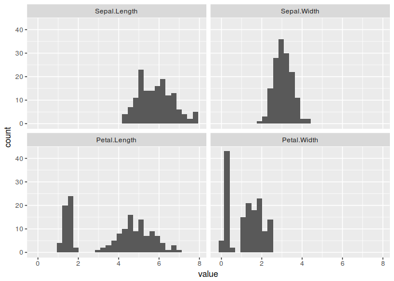<!-- -->

## Q4
Vary the number of bins in the above histogram. Describe what you see


```r
#Answer: With very few bins, we cannot show the bimodal distribution correctly

iris_melt %>%
  ggplot(aes(value)) +
  geom_histogram(bins=5) +
  facet_wrap(~variable)
```

<!-- -->


# Datacamp

## `ggplot2` on Datacamp

```r
library(ggplot2)
str(mtcars)
```

```
## 'data.frame':	32 obs. of  11 variables:
##  $ mpg : num  21 21 22.8 21.4 18.7 18.1 14.3 24.4 22.8 19.2 ...
##  $ cyl : num  6 6 4 6 8 6 8 4 4 6 ...
##  $ disp: num  160 160 108 258 360 ...
##  $ hp  : num  110 110 93 110 175 105 245 62 95 123 ...
##  $ drat: num  3.9 3.9 3.85 3.08 3.15 2.76 3.21 3.69 3.92 3.92 ...
##  $ wt  : num  2.62 2.88 2.32 3.21 3.44 ...
##  $ qsec: num  16.5 17 18.6 19.4 17 ...
##  $ vs  : num  0 0 1 1 0 1 0 1 1 1 ...
##  $ am  : num  1 1 1 0 0 0 0 0 0 0 ...
##  $ gear: num  4 4 4 3 3 3 3 4 4 4 ...
##  $ carb: num  4 4 1 1 2 1 4 2 2 4 ...
```

```r
ggplot(mtcars, aes(x = cyl, y = mpg)) +
  geom_point()
```

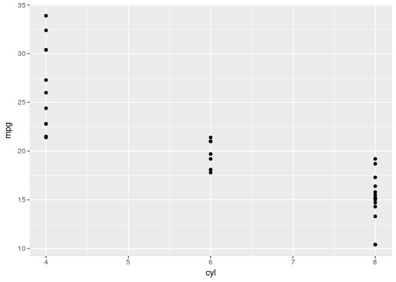<!-- -->

```r
#Stellar scatterplotting! Notice that ggplot2 treats cyl as a factor. 
#This time the x-axis does not contain variables like 5 or 7, only the values 
#that are present in the dataset.
```


```r
# Change the command below so that cyl is treated as factor
ggplot(mtcars, aes(x = factor(cyl), y = mpg)) +
  geom_point()
```

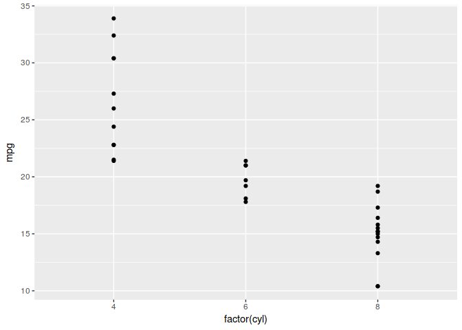<!-- -->


## Exploring ggplot2, part 3

We'll use several datasets throughout the courses to showcase the concepts discussed in the videos. In the previous exercises, you already got to know mtcars. Let's dive a little deeper to explore the three main topics in this course: The data, aesthetics, and geom layers.

The mtcars dataset contains information about 32 cars from 1973 Motor Trend magazine. This dataset is small, intuitive, and contains a variety of continuous and categorical variables.

You're encouraged to think about how the examples and concepts we discuss throughout these data viz courses apply to your own data-sets!

### Instructions

* `ggplot2` has already been loaded for you. Take a look at the first command. It plots the mpg (miles per galon) against the weight (in thousands of pounds). You don't have to change anything about this command.

* In the second call of ggplot() change the color argument in aes() (which stands for aesthetics). The color should be dependent on the displacement of the car engine, found in disp.

* In the third call of ggplot() change the size argument in aes() (which stands for aesthetics). The size should be dependent on the displacement of the car engine, found in disp.


```r
# A scatter plot has been made for you
ggplot(mtcars, aes(x = wt, y = mpg)) +
  geom_point()
```

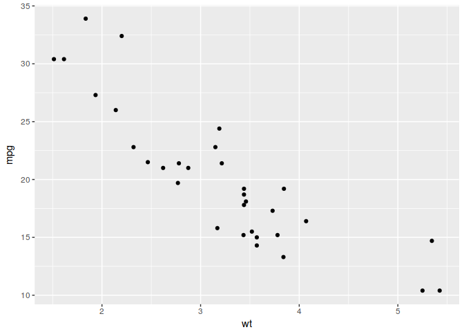<!-- -->

```r
# Replace ___ with the correct column
ggplot(mtcars, aes(x = wt, y = mpg, color = disp)) +
  geom_point()
```

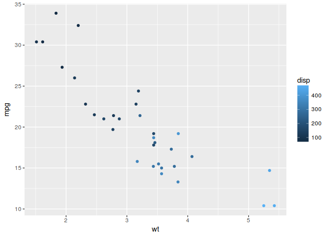<!-- -->

```r
# Replace ___ with the correct column
ggplot(mtcars, aes(x = wt, y = mpg, size = disp)) +
  geom_point()
```

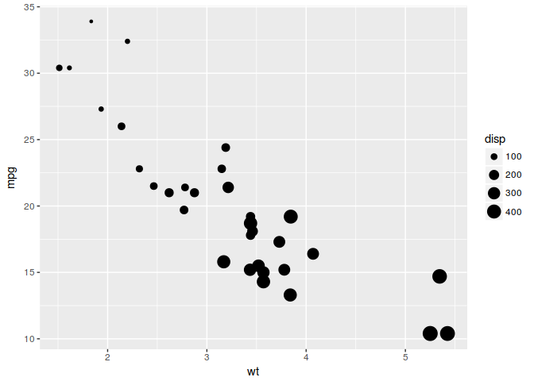<!-- -->

## Understanding Variables

In the previous exercise you saw that `disp` can be mapped onto a color gradient or onto a continuous size scale.

Another argument of `aes()` is the shape of the points. There are a finite number of shapes which ggplot() can automatically assign to the points. However, if you try this command in the console to the right:


```r
#ggplot(mtcars, aes(x = wt, y = mpg, shape = disp)) +
#  geom_point()
```

It gives an error. What does this mean?


```r
# Error: A continuous variable can not be mapped to shape
# 
# Correct. The error message 'A continuous variable can not be mapped to shape', 
# means that shape doesn't exist on a continuous scale here.
```

## Exploring ggplot2, part 4

The `diamonds` data frame contains information on the prices and various metrics of 50,000 diamonds. Among the variables included are `carat` (a measurement of the size of the diamond) and price. For the next exercises, you'll be using a subset of 1,000 diamonds.

Here you'll use two common geom layer functions: `geom_point()` and `geom_smooth()`. We already saw in the earlier exercises how these are added using the + operator.

### Instructions

* Explore the diamonds data frame with the `str()` function.
* Use the `+` operator to add `geom_point()` to the first `ggplot()` command. This will tell `ggplot2` to draw points on the plot.
* Use the `+` operator to add `geom_point()` and `geom_smooth()`. These just stack on each other! `geom_smooth()` will draw a smoothed line over the points.


```r
# Explore the diamonds data frame with str()
str(diamonds)
```

```
## Classes 'tbl_df', 'tbl' and 'data.frame':	53940 obs. of  10 variables:
##  $ carat  : num  0.23 0.21 0.23 0.29 0.31 0.24 0.24 0.26 0.22 0.23 ...
##  $ cut    : Ord.factor w/ 5 levels "Fair"<"Good"<..: 5 4 2 4 2 3 3 3 1 3 ...
##  $ color  : Ord.factor w/ 7 levels "D"<"E"<"F"<"G"<..: 2 2 2 6 7 7 6 5 2 5 ...
##  $ clarity: Ord.factor w/ 8 levels "I1"<"SI2"<"SI1"<..: 2 3 5 4 2 6 7 3 4 5 ...
##  $ depth  : num  61.5 59.8 56.9 62.4 63.3 62.8 62.3 61.9 65.1 59.4 ...
##  $ table  : num  55 61 65 58 58 57 57 55 61 61 ...
##  $ price  : int  326 326 327 334 335 336 336 337 337 338 ...
##  $ x      : num  3.95 3.89 4.05 4.2 4.34 3.94 3.95 4.07 3.87 4 ...
##  $ y      : num  3.98 3.84 4.07 4.23 4.35 3.96 3.98 4.11 3.78 4.05 ...
##  $ z      : num  2.43 2.31 2.31 2.63 2.75 2.48 2.47 2.53 2.49 2.39 ...
```

```r
# Add geom_point() with +
ggplot(diamonds, aes(x = carat, y = price)) +
  geom_point()
```

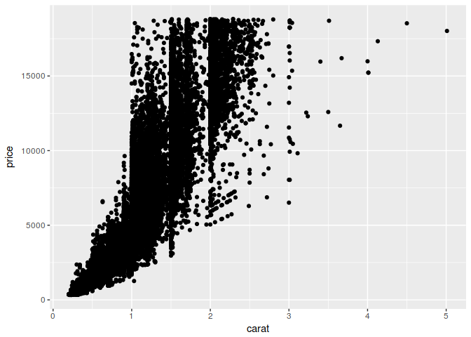<!-- -->

```r
# Add geom_point() and geom_smooth() with +
ggplot(diamonds, aes(x = carat, y = price)) +
  geom_point() +
  geom_smooth()
```

```
## `geom_smooth()` using method = 'gam'
```

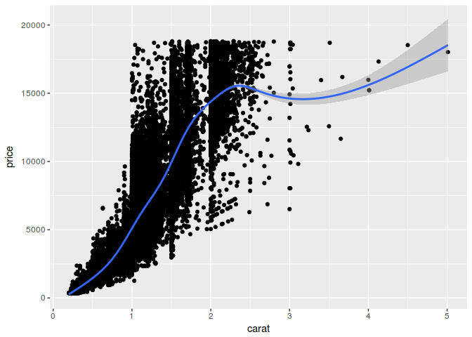<!-- -->

```r
# Lovely layering! If you had executed the command without adding a +, it would 
# produce an error message 'No layers in plot' because you are missing the third 
# essential layer - the geom layer.
```

## Exploring ggplot2, part 5

The code for last plot of the previous exercise is available in the script on the right. It builds a scatter plot of the diamonds dataset, with carat on the x-axis and price on the y-axis. geom_smooth() is used to add a smooth line.

With this plot as a starting point, let's explore some more possibilities of combining geoms.

### Instructions

* Plot 2 - Copy and paste plot 1, but show only the smooth line, no points.
* Plot 3 - Show only the smooth line, but color according to clarity by placing the argument color = clarity in the aes() function of your ggplot() call.
* Plot 4 - Draw translucent colored points.
  * Copy the ggplot() command from plot 3 (with clarity mapped to color).
  * Remove the smooth layer.
  * Add the points layer back in.
  * Set alpha = 0.4 inside geom_point(). This will make the points 40% transparent.
  

```r
# 1 - The plot you created in the previous exercise
ggplot(diamonds, aes(x = carat, y = price)) +
  geom_point() +
  geom_smooth()
```

```
## `geom_smooth()` using method = 'gam'
```

<!-- -->

```r
# 2 - Copy the above command but show only the smooth line
ggplot(diamonds, aes(x = carat, y = price)) +
  geom_smooth()
```

```
## `geom_smooth()` using method = 'gam'
```

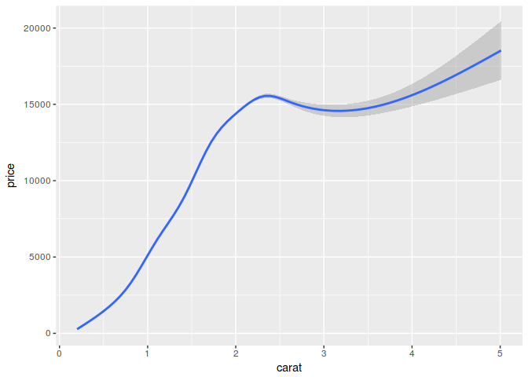<!-- -->

```r
# 3 - Copy the above command and assign the correct value to col in aes()
ggplot(diamonds, aes(x = carat, y = price, color=clarity)) +
  geom_smooth()
```

```
## `geom_smooth()` using method = 'gam'
```

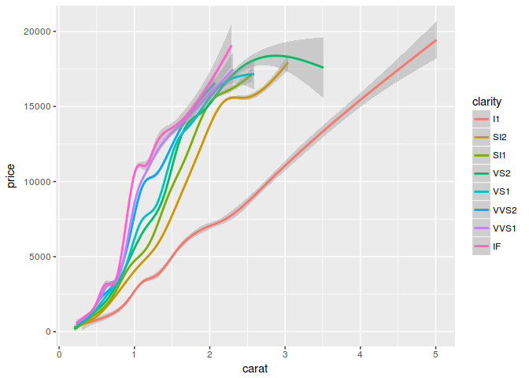<!-- -->

```r
# 4 - Keep the color settings from previous command. Plot only the points with argument alpha.
ggplot(diamonds, aes(x = carat, y = price, color=clarity)) +
  geom_point(alpha=0.4)
```

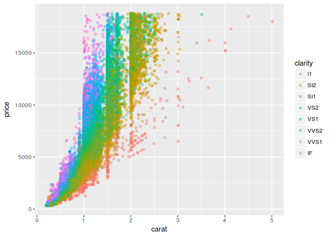<!-- -->

```r
## Smooth work! `geom_point() + geom_smooth()` is a common combination.
```

